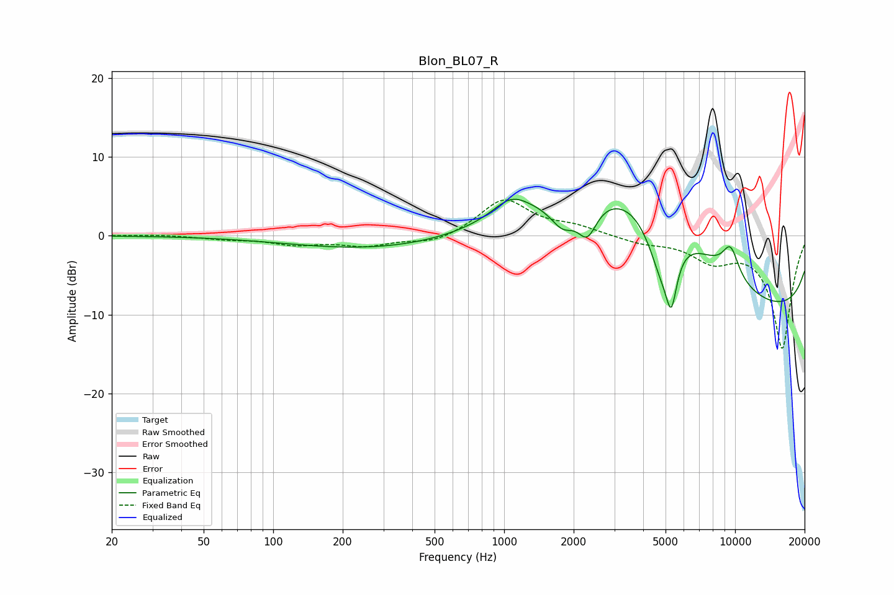

# Blon_BL07_R
See [usage instructions](https://github.com/jaakkopasanen/AutoEq#usage) for more options and info.

### Parametric EQs
Apply preamp of -4.7 dB when using parametric equalizer.

|   # | Type    |   Fc (Hz) |    Q |   Gain (dB) |
|-----|---------|-----------|------|-------------|
|   1 | Peaking |       388 | 0.31 |        -2.2 |
|   2 | Peaking |       662 | 0.64 |        -0.4 |
|   3 | Peaking |      1071 | 1.81 |         2.4 |
|   4 | Peaking |      1794 | 2.58 |        -3.1 |
|   5 | Peaking |      2292 | 3.38 |        -4.2 |
|   6 | Peaking |      4351 | 0.3  |        17.7 |
|   7 | Peaking |      4811 | 2.11 |        -7.9 |
|   8 | Peaking |      5297 | 5.94 |        -6   |
|   9 | Peaking |      9559 | 3.45 |         3.8 |
|  10 | Peaking |     10000 | 0.21 |       -16.3 |

### Fixed Band EQs
When using fixed band (also called graphic) equalizer, apply preamp of **-4.6 dB** (if available) and set gains manually with these parameters.

|   # | Type    |   Fc (Hz) |    Q |   Gain (dB) |
|-----|---------|-----------|------|-------------|
|   1 | Peaking |        31 | 1.41 |         0.1 |
|   2 | Peaking |        62 | 1.41 |        -0.4 |
|   3 | Peaking |       125 | 1.41 |        -1   |
|   4 | Peaking |       250 | 1.41 |        -1.2 |
|   5 | Peaking |       500 | 1.41 |        -1   |
|   6 | Peaking |      1000 | 1.41 |         4.6 |
|   7 | Peaking |      2000 | 1.41 |         1   |
|   8 | Peaking |      4000 | 1.41 |        -0.8 |
|   9 | Peaking |      8000 | 1.41 |        -2.8 |
|  10 | Peaking |     16000 | 1.41 |       -14.2 |

### Graphs

