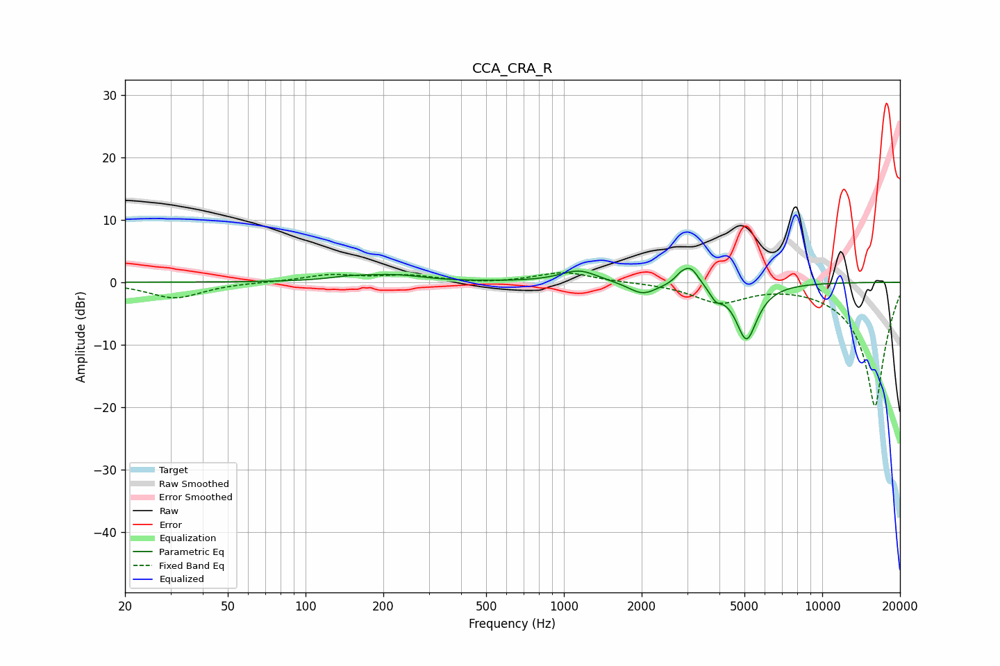

# CCA_CRA_R
See [usage instructions](https://github.com/jaakkopasanen/AutoEq#usage) for more options and info.

### Parametric EQs
Apply preamp of -2.3 dB when using parametric equalizer.

|   # | Type    |   Fc (Hz) |    Q |   Gain (dB) |
|-----|---------|-----------|------|-------------|
|   1 | Peaking |       148 | 1.92 |         0.4 |
|   2 | Peaking |       224 | 1    |         1.2 |
|   3 | Peaking |       313 | 1.18 |        -0.2 |
|   4 | Peaking |      1145 | 2.05 |         1.7 |
|   5 | Peaking |      1148 | 1.32 |         0.2 |
|   6 | Peaking |      2019 | 2.55 |        -2   |
|   7 | Peaking |      2836 | 6    |         1   |
|   8 | Peaking |      3098 | 4.39 |         2.8 |
|   9 | Peaking |      3876 | 5.99 |        -1.6 |
|  10 | Peaking |      5090 | 3.28 |        -9.1 |

### Fixed Band EQs
When using fixed band (also called graphic) equalizer, apply preamp of **-1.6 dB** (if available) and set gains manually with these parameters.

|   # | Type    |   Fc (Hz) |    Q |   Gain (dB) |
|-----|---------|-----------|------|-------------|
|   1 | Peaking |        31 | 1.41 |        -2.5 |
|   2 | Peaking |        62 | 1.41 |         0   |
|   3 | Peaking |       125 | 1.41 |         1.1 |
|   4 | Peaking |       250 | 1.41 |         1   |
|   5 | Peaking |       500 | 1.41 |        -0.2 |
|   6 | Peaking |      1000 | 1.41 |         1.6 |
|   7 | Peaking |      2000 | 1.41 |         0   |
|   8 | Peaking |      4000 | 1.41 |        -3   |
|   9 | Peaking |      8000 | 1.41 |         0.1 |
|  10 | Peaking |     16000 | 1.41 |       -20   |

### Graphs

