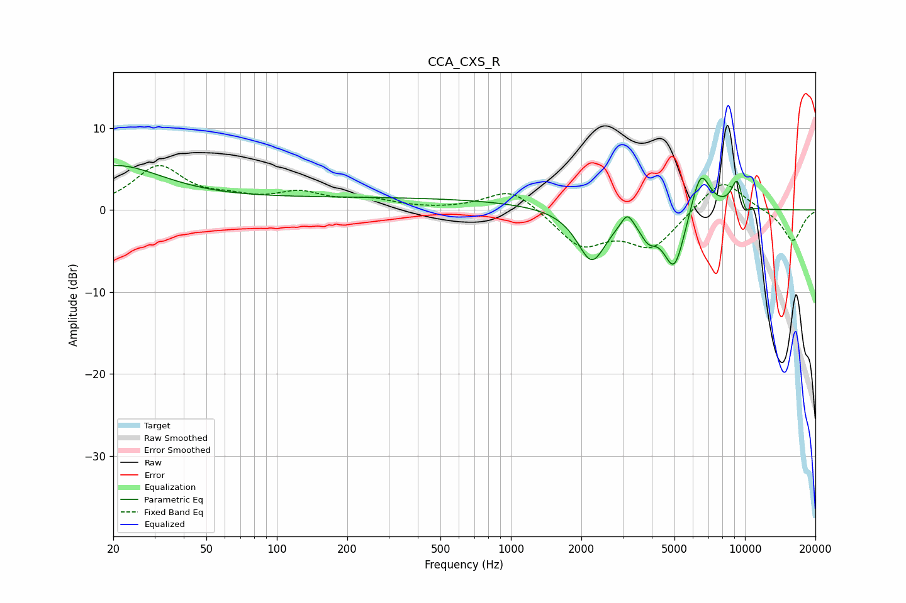

# CCA_CXS_R
See [usage instructions](https://github.com/jaakkopasanen/AutoEq#usage) for more options and info.

### Parametric EQs
Apply preamp of -5.5 dB when using parametric equalizer.

|   # | Type    |   Fc (Hz) |    Q |   Gain (dB) |
|-----|---------|-----------|------|-------------|
|   1 | Peaking |        20 | 0.65 |         5.2 |
|   2 | Peaking |       255 | 0.18 |         1.5 |
|   3 | Peaking |      2215 | 2.29 |        -6.3 |
|   4 | Peaking |      3144 | 5.46 |         1.8 |
|   5 | Peaking |      3860 | 4.06 |        -2.1 |
|   6 | Peaking |      4991 | 2.9  |        -7.4 |
|   7 | Peaking |      6460 | 3.19 |         5.8 |
|   8 | Peaking |      7842 | 6    |         0.1 |
|   9 | Peaking |      9293 | 4.76 |         4.1 |
|  10 | Peaking |     10000 | 5.5  |        -1.8 |

### Fixed Band EQs
When using fixed band (also called graphic) equalizer, apply preamp of **-5.5 dB** (if available) and set gains manually with these parameters.

|   # | Type    |   Fc (Hz) |    Q |   Gain (dB) |
|-----|---------|-----------|------|-------------|
|   1 | Peaking |        31 | 1.41 |         5.2 |
|   2 | Peaking |        62 | 1.41 |         1   |
|   3 | Peaking |       125 | 1.41 |         1.8 |
|   4 | Peaking |       250 | 1.41 |         1.1 |
|   5 | Peaking |       500 | 1.41 |        -0   |
|   6 | Peaking |      1000 | 1.41 |         2.8 |
|   7 | Peaking |      2000 | 1.41 |        -4.3 |
|   8 | Peaking |      4000 | 1.41 |        -4.4 |
|   9 | Peaking |      8000 | 1.41 |         4   |
|  10 | Peaking |     16000 | 1.41 |        -3.9 |

### Graphs

