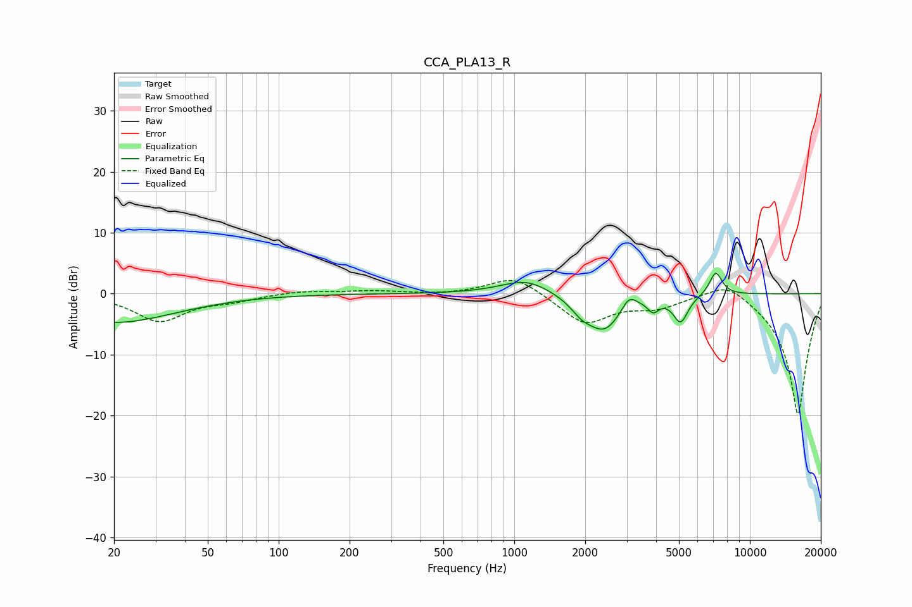

# CCA_PLA13_R
See [usage instructions](https://github.com/jaakkopasanen/AutoEq#usage) for more options and info.

### Parametric EQs
Apply preamp of -3.5 dB when using parametric equalizer.

|   # | Type    |   Fc (Hz) |    Q |   Gain (dB) |
|-----|---------|-----------|------|-------------|
|   1 | Peaking |        20 | 0.54 |        -4.7 |
|   2 | Peaking |      1023 | 2.22 |        -0.2 |
|   3 | Peaking |      1116 | 1.35 |         2.6 |
|   4 | Peaking |      1931 | 3.11 |        -1.7 |
|   5 | Peaking |      2413 | 1.83 |        -6   |
|   6 | Peaking |      3067 | 4.4  |         2.3 |
|   7 | Peaking |      3212 | 1.43 |         0.1 |
|   8 | Peaking |      3886 | 6    |        -1.9 |
|   9 | Peaking |      5081 | 4.45 |        -4.3 |
|  10 | Peaking |      7165 | 5.03 |         3.9 |

### Fixed Band EQs
When using fixed band (also called graphic) equalizer, apply preamp of **-2.3 dB** (if available) and set gains manually with these parameters.

|   # | Type    |   Fc (Hz) |    Q |   Gain (dB) |
|-----|---------|-----------|------|-------------|
|   1 | Peaking |        31 | 1.41 |        -4.4 |
|   2 | Peaking |        62 | 1.41 |        -0.9 |
|   3 | Peaking |       125 | 1.41 |         0.5 |
|   4 | Peaking |       250 | 1.41 |         0.5 |
|   5 | Peaking |       500 | 1.41 |        -0.2 |
|   6 | Peaking |      1000 | 1.41 |         3.1 |
|   7 | Peaking |      2000 | 1.41 |        -4.9 |
|   8 | Peaking |      4000 | 1.41 |        -1.9 |
|   9 | Peaking |      8000 | 1.41 |         2.8 |
|  10 | Peaking |     16000 | 1.41 |       -20   |

### Graphs

