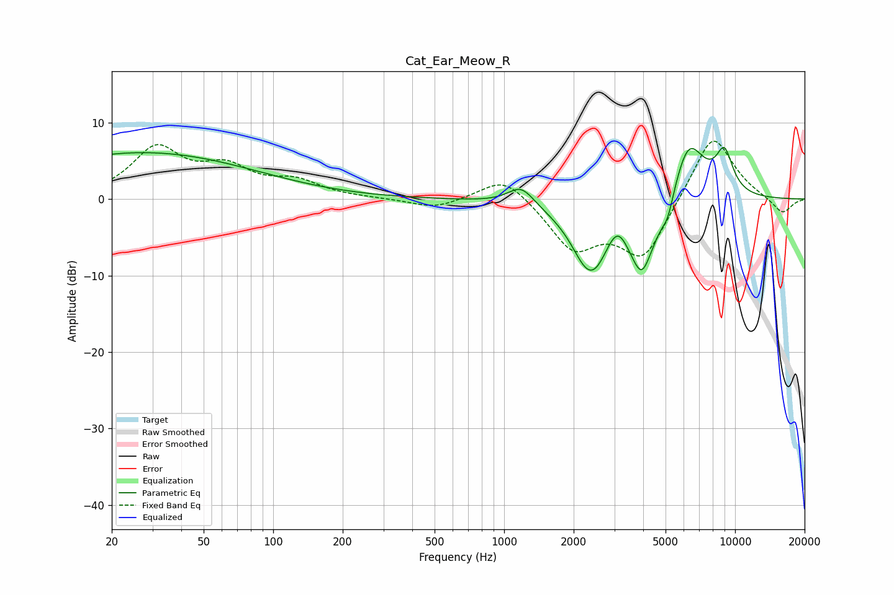

# Cat_Ear_Meow_R
See [usage instructions](https://github.com/jaakkopasanen/AutoEq#usage) for more options and info.

### Parametric EQs
Apply preamp of -6.9 dB when using parametric equalizer.

|   # | Type    |   Fc (Hz) |    Q |   Gain (dB) |
|-----|---------|-----------|------|-------------|
|   1 | Peaking |        27 | 0.29 |         6.1 |
|   2 | Peaking |      1185 | 2.46 |         2.6 |
|   3 | Peaking |      2293 | 2    |        -6.2 |
|   4 | Peaking |      2523 | 3.31 |        -1.3 |
|   5 | Peaking |      3110 | 2.96 |         4   |
|   6 | Peaking |      3916 | 1.03 |        -8.6 |
|   7 | Peaking |      3947 | 3.89 |        -3.4 |
|   8 | Peaking |      5119 | 6    |        -1.9 |
|   9 | Peaking |      6254 | 1.7  |        10.3 |
|  10 | Peaking |      8994 | 3.4  |         5.2 |

### Fixed Band EQs
When using fixed band (also called graphic) equalizer, apply preamp of **-7.7 dB** (if available) and set gains manually with these parameters.

|   # | Type    |   Fc (Hz) |    Q |   Gain (dB) |
|-----|---------|-----------|------|-------------|
|   1 | Peaking |        31 | 1.41 |         6.4 |
|   2 | Peaking |        62 | 1.41 |         3.5 |
|   3 | Peaking |       125 | 1.41 |         2   |
|   4 | Peaking |       250 | 1.41 |         0.1 |
|   5 | Peaking |       500 | 1.41 |        -1.3 |
|   6 | Peaking |      1000 | 1.41 |         3.4 |
|   7 | Peaking |      2000 | 1.41 |        -6.2 |
|   8 | Peaking |      4000 | 1.41 |        -7.7 |
|   9 | Peaking |      8000 | 1.41 |         9   |
|  10 | Peaking |     16000 | 1.41 |        -2.1 |

### Graphs

