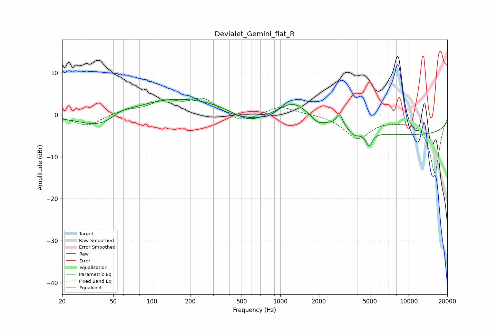

# Devialet_Gemini_flat_R
See [usage instructions](https://github.com/jaakkopasanen/AutoEq#usage) for more options and info.

### Parametric EQs
Apply preamp of -3.8 dB when using parametric equalizer.

|   # | Type    |   Fc (Hz) |    Q |   Gain (dB) |
|-----|---------|-----------|------|-------------|
|   1 | Peaking |        42 | 0.76 |        -4.6 |
|   2 | Peaking |        57 | 1.64 |         1.7 |
|   3 | Peaking |       150 | 0.32 |         4.4 |
|   4 | Peaking |       568 | 1.03 |        -3.1 |
|   5 | Peaking |      1273 | 1.26 |         3.9 |
|   6 | Peaking |      1954 | 3.23 |        -1.3 |
|   7 | Peaking |      2897 | 5.64 |         3.1 |
|   8 | Peaking |      3785 | 3.18 |        -1.4 |
|   9 | Peaking |      4915 | 5.82 |        -3.1 |
|  10 | Peaking |     10000 | 0.18 |        -4.7 |

### Fixed Band EQs
When using fixed band (also called graphic) equalizer, apply preamp of **-4.1 dB** (if available) and set gains manually with these parameters.

|   # | Type    |   Fc (Hz) |    Q |   Gain (dB) |
|-----|---------|-----------|------|-------------|
|   1 | Peaking |        31 | 1.41 |        -2.7 |
|   2 | Peaking |        62 | 1.41 |         1   |
|   3 | Peaking |       125 | 1.41 |         3   |
|   4 | Peaking |       250 | 1.41 |         3.7 |
|   5 | Peaking |       500 | 1.41 |        -2.1 |
|   6 | Peaking |      1000 | 1.41 |         2.1 |
|   7 | Peaking |      2000 | 1.41 |         0.2 |
|   8 | Peaking |      4000 | 1.41 |        -5.5 |
|   9 | Peaking |      8000 | 1.41 |        -0.6 |
|  10 | Peaking |     16000 | 1.41 |       -13.8 |

### Graphs

