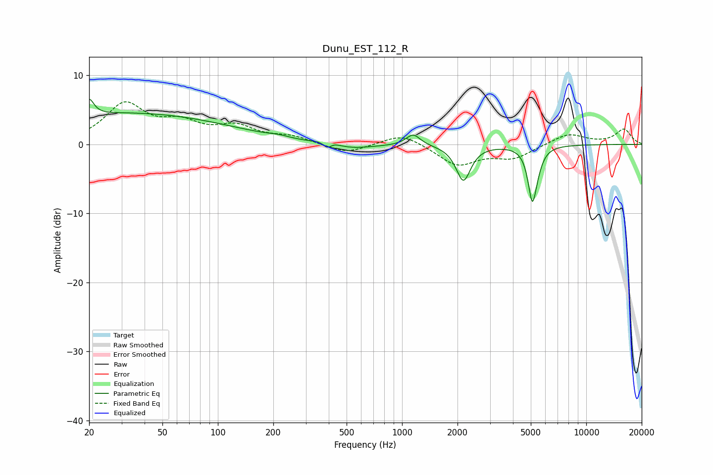

# Dunu_EST_112_R
See [usage instructions](https://github.com/jaakkopasanen/AutoEq#usage) for more options and info.

### Parametric EQs
Apply preamp of -6.6 dB when using parametric equalizer.

|   # | Type    |   Fc (Hz) |    Q |   Gain (dB) |
|-----|---------|-----------|------|-------------|
|   1 | Peaking |        20 | 5.75 |         2.3 |
|   2 | Peaking |        33 | 0.25 |         4.5 |
|   3 | Peaking |       215 | 2.44 |         0.3 |
|   4 | Peaking |       393 | 5.9  |        -1.2 |
|   5 | Peaking |       397 | 2.59 |         1.1 |
|   6 | Peaking |       481 | 1.08 |        -1   |
|   7 | Peaking |      1150 | 3.66 |         1.7 |
|   8 | Peaking |      2152 | 3.62 |        -5.2 |
|   9 | Peaking |      5099 | 6    |        -7.6 |
|  10 | Peaking |      5477 | 5.02 |        -1   |

### Fixed Band EQs
When using fixed band (also called graphic) equalizer, apply preamp of **-6.3 dB** (if available) and set gains manually with these parameters.

|   # | Type    |   Fc (Hz) |    Q |   Gain (dB) |
|-----|---------|-----------|------|-------------|
|   1 | Peaking |        31 | 1.41 |         5.6 |
|   2 | Peaking |        62 | 1.41 |         2.5 |
|   3 | Peaking |       125 | 1.41 |         2.3 |
|   4 | Peaking |       250 | 1.41 |         1   |
|   5 | Peaking |       500 | 1.41 |        -1.4 |
|   6 | Peaking |      1000 | 1.41 |         1.7 |
|   7 | Peaking |      2000 | 1.41 |        -3   |
|   8 | Peaking |      4000 | 1.41 |        -1.9 |
|   9 | Peaking |      8000 | 1.41 |         1.6 |
|  10 | Peaking |     16000 | 1.41 |         2.2 |

### Graphs

