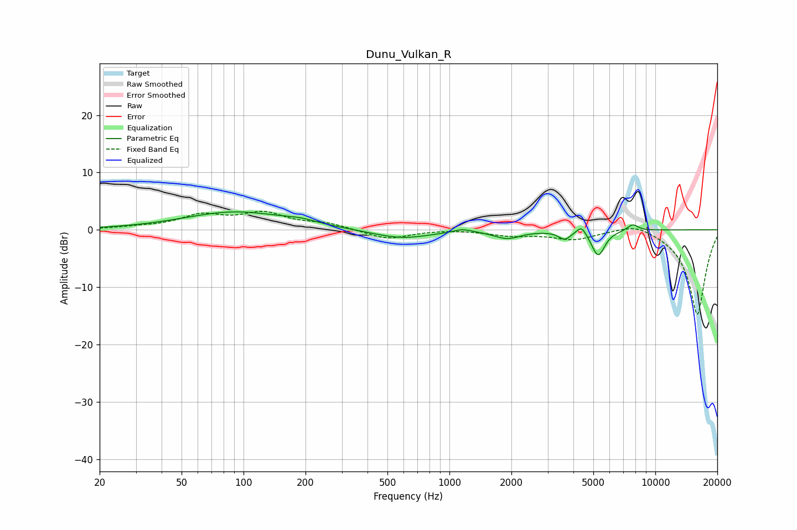

# Dunu_Vulkan_R
See [usage instructions](https://github.com/jaakkopasanen/AutoEq#usage) for more options and info.

### Parametric EQs
Apply preamp of -3.2 dB when using parametric equalizer.

|   # | Type    |   Fc (Hz) |    Q |   Gain (dB) |
|-----|---------|-----------|------|-------------|
|   1 | Peaking |        92 | 0.57 |         3.1 |
|   2 | Peaking |       190 | 1.91 |         0.6 |
|   3 | Peaking |       581 | 1.01 |        -1.6 |
|   4 | Peaking |      1157 | 3.14 |         0.6 |
|   5 | Peaking |      1912 | 2.23 |        -1.4 |
|   6 | Peaking |      3629 | 4.83 |        -1.4 |
|   7 | Peaking |      4381 | 6    |         1.6 |
|   8 | Peaking |      5159 | 3.92 |        -0.5 |
|   9 | Peaking |      5289 | 4.45 |        -4.1 |
|  10 | Peaking |      7762 | 5.01 |         1.1 |

### Fixed Band EQs
When using fixed band (also called graphic) equalizer, apply preamp of **-3.3 dB** (if available) and set gains manually with these parameters.

|   # | Type    |   Fc (Hz) |    Q |   Gain (dB) |
|-----|---------|-----------|------|-------------|
|   1 | Peaking |        31 | 1.41 |         0.3 |
|   2 | Peaking |        62 | 1.41 |         2.3 |
|   3 | Peaking |       125 | 1.41 |         2.7 |
|   4 | Peaking |       250 | 1.41 |         1   |
|   5 | Peaking |       500 | 1.41 |        -1.7 |
|   6 | Peaking |      1000 | 1.41 |         0.1 |
|   7 | Peaking |      2000 | 1.41 |        -0.9 |
|   8 | Peaking |      4000 | 1.41 |        -1.6 |
|   9 | Peaking |      8000 | 1.41 |         1.5 |
|  10 | Peaking |     16000 | 1.41 |       -14.9 |

### Graphs

