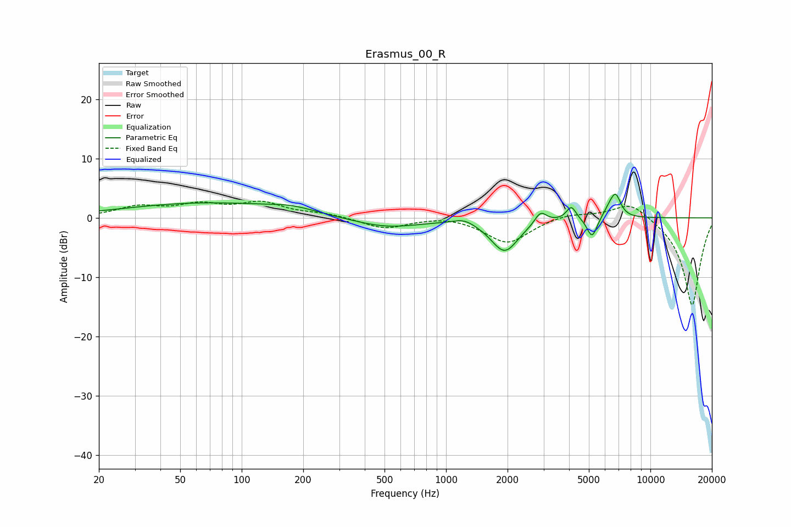

# Erasmus_00_R
See [usage instructions](https://github.com/jaakkopasanen/AutoEq#usage) for more options and info.

### Parametric EQs
Apply preamp of -4.1 dB when using parametric equalizer.

|   # | Type    |   Fc (Hz) |    Q |   Gain (dB) |
|-----|---------|-----------|------|-------------|
|   1 | Peaking |        68 | 0.34 |         2.5 |
|   2 | Peaking |       175 | 1.35 |         0.8 |
|   3 | Peaking |       507 | 0.84 |        -1.7 |
|   4 | Peaking |      1228 | 2.65 |         0.9 |
|   5 | Peaking |      1936 | 2.08 |        -5.6 |
|   6 | Peaking |      2902 | 4.95 |         2.1 |
|   7 | Peaking |      4103 | 6    |         2.3 |
|   8 | Peaking |      5184 | 5.63 |        -3.5 |
|   9 | Peaking |      6315 | 4.6  |         1.5 |
|  10 | Peaking |      6776 | 5.56 |         3.3 |

### Fixed Band EQs
When using fixed band (also called graphic) equalizer, apply preamp of **-2.9 dB** (if available) and set gains manually with these parameters.

|   # | Type    |   Fc (Hz) |    Q |   Gain (dB) |
|-----|---------|-----------|------|-------------|
|   1 | Peaking |        31 | 1.41 |         1.7 |
|   2 | Peaking |        62 | 1.41 |         1.9 |
|   3 | Peaking |       125 | 1.41 |         2.3 |
|   4 | Peaking |       250 | 1.41 |         0.6 |
|   5 | Peaking |       500 | 1.41 |        -1.8 |
|   6 | Peaking |      1000 | 1.41 |         0.5 |
|   7 | Peaking |      2000 | 1.41 |        -4.3 |
|   8 | Peaking |      4000 | 1.41 |         0.9 |
|   9 | Peaking |      8000 | 1.41 |         2.9 |
|  10 | Peaking |     16000 | 1.41 |       -14.9 |

### Graphs

