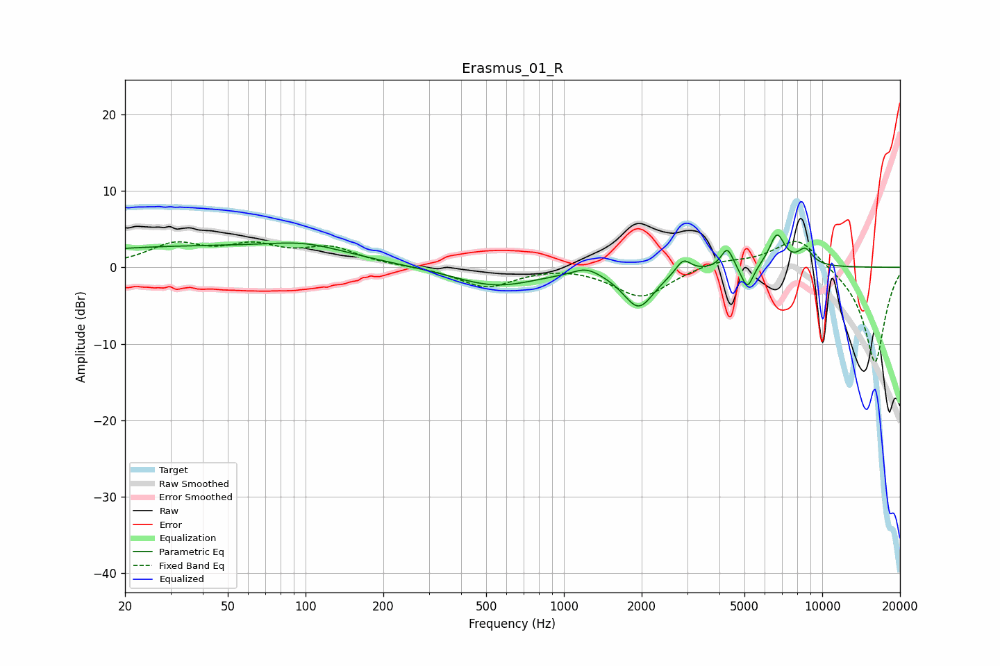

# Erasmus_01_R
See [usage instructions](https://github.com/jaakkopasanen/AutoEq#usage) for more options and info.

### Parametric EQs
Apply preamp of -4.3 dB when using parametric equalizer.

|   # | Type    |   Fc (Hz) |    Q |   Gain (dB) |
|-----|---------|-----------|------|-------------|
|   1 | Peaking |        35 | 0.25 |         2.6 |
|   2 | Peaking |       101 | 0.98 |         1.3 |
|   3 | Peaking |       543 | 0.87 |        -2.5 |
|   4 | Peaking |      1223 | 2.68 |         1.1 |
|   5 | Peaking |      1948 | 2.34 |        -5.1 |
|   6 | Peaking |      2896 | 5.01 |         1.8 |
|   7 | Peaking |      4289 | 6    |         2.7 |
|   8 | Peaking |      5127 | 5.89 |        -3.2 |
|   9 | Peaking |      6679 | 4.57 |         4.2 |
|  10 | Peaking |      8593 | 4.32 |         2.1 |

### Fixed Band EQs
When using fixed band (also called graphic) equalizer, apply preamp of **-3.5 dB** (if available) and set gains manually with these parameters.

|   # | Type    |   Fc (Hz) |    Q |   Gain (dB) |
|-----|---------|-----------|------|-------------|
|   1 | Peaking |        31 | 1.41 |         2.8 |
|   2 | Peaking |        62 | 1.41 |         2.4 |
|   3 | Peaking |       125 | 1.41 |         2.3 |
|   4 | Peaking |       250 | 1.41 |         0.1 |
|   5 | Peaking |       500 | 1.41 |        -2.6 |
|   6 | Peaking |      1000 | 1.41 |         0.3 |
|   7 | Peaking |      2000 | 1.41 |        -4   |
|   8 | Peaking |      4000 | 1.41 |         0.9 |
|   9 | Peaking |      8000 | 1.41 |         4.1 |
|  10 | Peaking |     16000 | 1.41 |       -12.6 |

### Graphs

