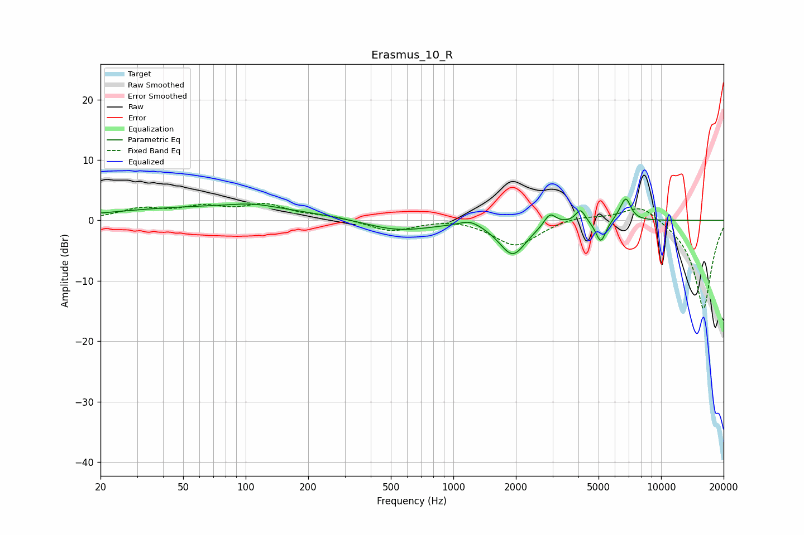

# Erasmus_10_R
See [usage instructions](https://github.com/jaakkopasanen/AutoEq#usage) for more options and info.

### Parametric EQs
Apply preamp of -3.6 dB when using parametric equalizer.

|   # | Type    |   Fc (Hz) |    Q |   Gain (dB) |
|-----|---------|-----------|------|-------------|
|   1 | Peaking |        72 | 0.28 |         2.2 |
|   2 | Peaking |       108 | 1.39 |         0.7 |
|   3 | Peaking |       536 | 0.87 |        -1.8 |
|   4 | Peaking |      1208 | 2.65 |         1.1 |
|   5 | Peaking |      1931 | 2.16 |        -5.6 |
|   6 | Peaking |      2918 | 4.95 |         2.1 |
|   7 | Peaking |      4093 | 6    |         2.2 |
|   8 | Peaking |      5126 | 5.7  |        -3.7 |
|   9 | Peaking |      6504 | 4.69 |         1.2 |
|  10 | Peaking |      6804 | 5.87 |         2.8 |

### Fixed Band EQs
When using fixed band (also called graphic) equalizer, apply preamp of **-2.9 dB** (if available) and set gains manually with these parameters.

|   # | Type    |   Fc (Hz) |    Q |   Gain (dB) |
|-----|---------|-----------|------|-------------|
|   1 | Peaking |        31 | 1.41 |         1.7 |
|   2 | Peaking |        62 | 1.41 |         1.9 |
|   3 | Peaking |       125 | 1.41 |         2.3 |
|   4 | Peaking |       250 | 1.41 |         0.6 |
|   5 | Peaking |       500 | 1.41 |        -1.8 |
|   6 | Peaking |      1000 | 1.41 |         0.5 |
|   7 | Peaking |      2000 | 1.41 |        -4.3 |
|   8 | Peaking |      4000 | 1.41 |         0.8 |
|   9 | Peaking |      8000 | 1.41 |         2.9 |
|  10 | Peaking |     16000 | 1.41 |       -14.8 |

### Graphs

