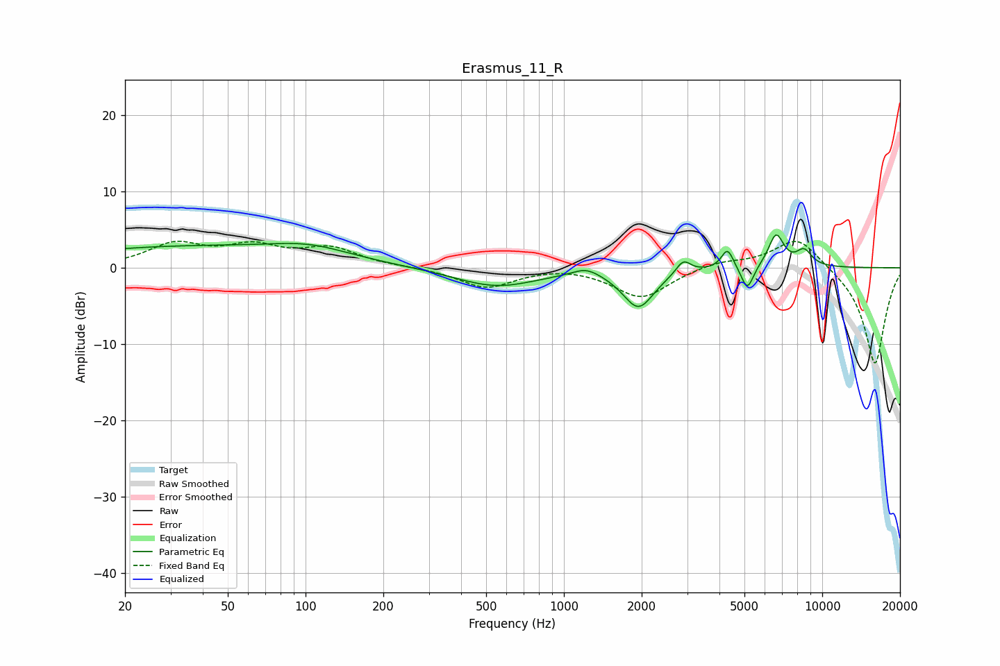

# Erasmus_11_R
See [usage instructions](https://github.com/jaakkopasanen/AutoEq#usage) for more options and info.

### Parametric EQs
Apply preamp of -4.4 dB when using parametric equalizer.

|   # | Type    |   Fc (Hz) |    Q |   Gain (dB) |
|-----|---------|-----------|------|-------------|
|   1 | Peaking |        34 | 0.28 |         2.7 |
|   2 | Peaking |       104 | 0.91 |         1.5 |
|   3 | Peaking |       545 | 0.89 |        -2.5 |
|   4 | Peaking |      1222 | 2.64 |         1.1 |
|   5 | Peaking |      1944 | 2.33 |        -5.1 |
|   6 | Peaking |      2898 | 5.04 |         1.8 |
|   7 | Peaking |      4298 | 6    |         2.7 |
|   8 | Peaking |      5129 | 5.87 |        -3.3 |
|   9 | Peaking |      6629 | 4.51 |         4.3 |
|  10 | Peaking |      8505 | 4.19 |         2.1 |

### Fixed Band EQs
When using fixed band (also called graphic) equalizer, apply preamp of **-3.6 dB** (if available) and set gains manually with these parameters.

|   # | Type    |   Fc (Hz) |    Q |   Gain (dB) |
|-----|---------|-----------|------|-------------|
|   1 | Peaking |        31 | 1.41 |         2.9 |
|   2 | Peaking |        62 | 1.41 |         2.5 |
|   3 | Peaking |       125 | 1.41 |         2.4 |
|   4 | Peaking |       250 | 1.41 |         0.1 |
|   5 | Peaking |       500 | 1.41 |        -2.6 |
|   6 | Peaking |      1000 | 1.41 |         0.3 |
|   7 | Peaking |      2000 | 1.41 |        -4   |
|   8 | Peaking |      4000 | 1.41 |         0.9 |
|   9 | Peaking |      8000 | 1.41 |         4.2 |
|  10 | Peaking |     16000 | 1.41 |       -12.8 |

### Graphs

