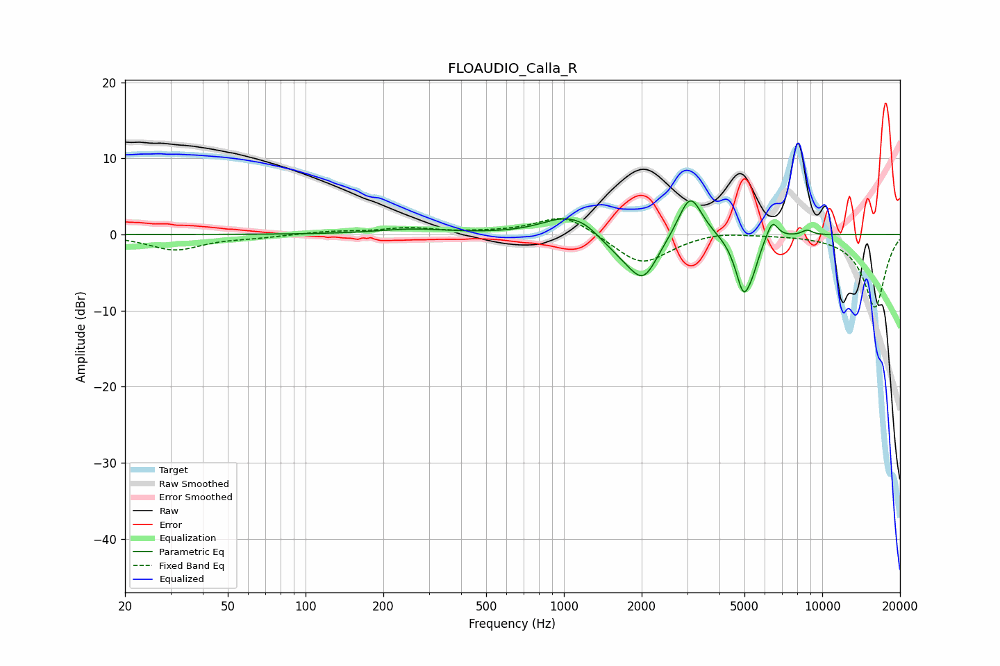

# FLOAUDIO_Calla_R
See [usage instructions](https://github.com/jaakkopasanen/AutoEq#usage) for more options and info.

### Parametric EQs
Apply preamp of -4.5 dB when using parametric equalizer.

|   # | Type    |   Fc (Hz) |    Q |   Gain (dB) |
|-----|---------|-----------|------|-------------|
|   1 | Peaking |       259 | 1.04 |         0.7 |
|   2 | Peaking |      1017 | 1.51 |         2.4 |
|   3 | Peaking |      1210 | 2.95 |         0.6 |
|   4 | Peaking |      1687 | 1.78 |        -1.9 |
|   5 | Peaking |      2035 | 2.46 |        -5.2 |
|   6 | Peaking |      3082 | 3.02 |         5.9 |
|   7 | Peaking |      4961 | 4.3  |        -7.4 |
|   8 | Peaking |      5405 | 5.97 |        -1.6 |
|   9 | Peaking |      6401 | 6    |         2.5 |
|  10 | Peaking |      8742 | 6    |         0.7 |

### Fixed Band EQs
When using fixed band (also called graphic) equalizer, apply preamp of **-2.2 dB** (if available) and set gains manually with these parameters.

|   # | Type    |   Fc (Hz) |    Q |   Gain (dB) |
|-----|---------|-----------|------|-------------|
|   1 | Peaking |        31 | 1.41 |        -2   |
|   2 | Peaking |        62 | 1.41 |        -0.3 |
|   3 | Peaking |       125 | 1.41 |         0.4 |
|   4 | Peaking |       250 | 1.41 |         0.8 |
|   5 | Peaking |       500 | 1.41 |         0.1 |
|   6 | Peaking |      1000 | 1.41 |         2.7 |
|   7 | Peaking |      2000 | 1.41 |        -4   |
|   8 | Peaking |      4000 | 1.41 |         0.6 |
|   9 | Peaking |      8000 | 1.41 |         0   |
|  10 | Peaking |     16000 | 1.41 |        -9.6 |

### Graphs

