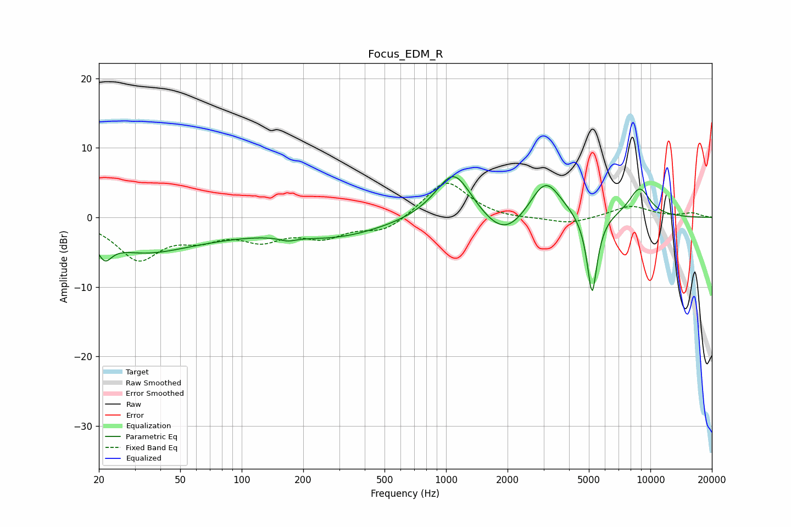

# Focus_EDM_R
See [usage instructions](https://github.com/jaakkopasanen/AutoEq#usage) for more options and info.

### Parametric EQs
Apply preamp of -5.9 dB when using parametric equalizer.

|   # | Type    |   Fc (Hz) |    Q |   Gain (dB) |
|-----|---------|-----------|------|-------------|
|   1 | Peaking |        21 | 4.21 |        -2.7 |
|   2 | Peaking |        32 | 0.64 |        -4.1 |
|   3 | Peaking |        72 | 0.53 |        -1.4 |
|   4 | Peaking |       168 | 3.44 |        -0.6 |
|   5 | Peaking |       288 | 0.58 |        -2.6 |
|   6 | Peaking |      1092 | 1.57 |         7.3 |
|   7 | Peaking |      1933 | 1.27 |        -4   |
|   8 | Peaking |      3060 | 1.78 |         6   |
|   9 | Peaking |      5185 | 5.4  |       -11.9 |
|  10 | Peaking |      8850 | 2.41 |         4.2 |

### Fixed Band EQs
When using fixed band (also called graphic) equalizer, apply preamp of **-5.0 dB** (if available) and set gains manually with these parameters.

|   # | Type    |   Fc (Hz) |    Q |   Gain (dB) |
|-----|---------|-----------|------|-------------|
|   1 | Peaking |        31 | 1.41 |        -5.7 |
|   2 | Peaking |        62 | 1.41 |        -2.3 |
|   3 | Peaking |       125 | 1.41 |        -2.7 |
|   4 | Peaking |       250 | 1.41 |        -2.5 |
|   5 | Peaking |       500 | 1.41 |        -2   |
|   6 | Peaking |      1000 | 1.41 |         5.5 |
|   7 | Peaking |      2000 | 1.41 |        -0.3 |
|   8 | Peaking |      4000 | 1.41 |        -1   |
|   9 | Peaking |      8000 | 1.41 |         1.7 |
|  10 | Peaking |     16000 | 1.41 |         0.6 |

### Graphs

