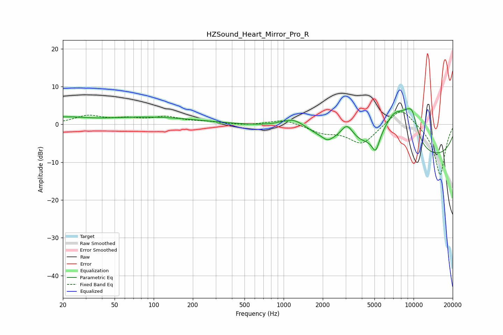

# HZSound_Heart_Mirror_Pro_R
See [usage instructions](https://github.com/jaakkopasanen/AutoEq#usage) for more options and info.

### Parametric EQs
Apply preamp of -4.2 dB when using parametric equalizer.

|   # | Type    |   Fc (Hz) |    Q |   Gain (dB) |
|-----|---------|-----------|------|-------------|
|   1 | Peaking |        20 | 0.89 |         1.5 |
|   2 | Peaking |        95 | 0.4  |         1.8 |
|   3 | Peaking |      1200 | 1.37 |         3.4 |
|   4 | Peaking |      2174 | 3.86 |        -1.2 |
|   5 | Peaking |      3069 | 2.73 |         4.8 |
|   6 | Peaking |      5106 | 4.97 |        -4.2 |
|   7 | Peaking |      7043 | 1.28 |         9.5 |
|   8 | Peaking |      9075 | 1.73 |         6.5 |
|   9 | Peaking |      9541 | 0.18 |       -10   |
|  10 | Peaking |      9822 | 3.8  |         3.5 |

### Fixed Band EQs
When using fixed band (also called graphic) equalizer, apply preamp of **-3.4 dB** (if available) and set gains manually with these parameters.

|   # | Type    |   Fc (Hz) |    Q |   Gain (dB) |
|-----|---------|-----------|------|-------------|
|   1 | Peaking |        31 | 1.41 |         2.1 |
|   2 | Peaking |        62 | 1.41 |         1.2 |
|   3 | Peaking |       125 | 1.41 |         1.8 |
|   4 | Peaking |       250 | 1.41 |         0.6 |
|   5 | Peaking |       500 | 1.41 |        -0.3 |
|   6 | Peaking |      1000 | 1.41 |         1.4 |
|   7 | Peaking |      2000 | 1.41 |        -2   |
|   8 | Peaking |      4000 | 1.41 |        -5.2 |
|   9 | Peaking |      8000 | 1.41 |         5   |
|  10 | Peaking |     16000 | 1.41 |       -13.6 |

### Graphs

