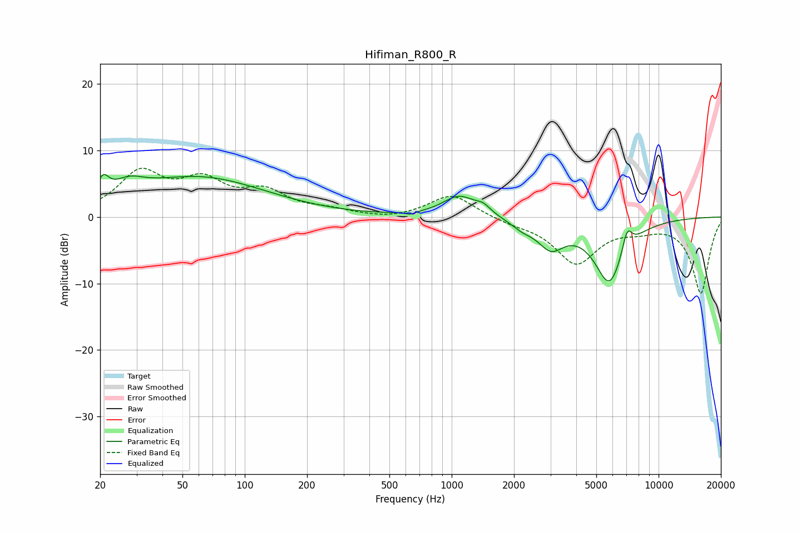

# Hifiman_R800_R
See [usage instructions](https://github.com/jaakkopasanen/AutoEq#usage) for more options and info.

### Parametric EQs
Apply preamp of -6.5 dB when using parametric equalizer.

|   # | Type    |   Fc (Hz) |    Q |   Gain (dB) |
|-----|---------|-----------|------|-------------|
|   1 | Peaking |        21 | 5.22 |         2.7 |
|   2 | Peaking |        27 | 1.87 |         2.1 |
|   3 | Peaking |        60 | 0.43 |         5.9 |
|   4 | Peaking |       634 | 5.99 |        -0.4 |
|   5 | Peaking |      1088 | 1.77 |         3.1 |
|   6 | Peaking |      1420 | 3.92 |         1.1 |
|   7 | Peaking |      2192 | 2.61 |        -1.1 |
|   8 | Peaking |      3015 | 2.21 |        -3.9 |
|   9 | Peaking |      5786 | 1.86 |        -9.7 |
|  10 | Peaking |      7042 | 5.68 |         3.4 |

### Fixed Band EQs
When using fixed band (also called graphic) equalizer, apply preamp of **-7.4 dB** (if available) and set gains manually with these parameters.

|   # | Type    |   Fc (Hz) |    Q |   Gain (dB) |
|-----|---------|-----------|------|-------------|
|   1 | Peaking |        31 | 1.41 |         6.3 |
|   2 | Peaking |        62 | 1.41 |         4.7 |
|   3 | Peaking |       125 | 1.41 |         3.3 |
|   4 | Peaking |       250 | 1.41 |         0.8 |
|   5 | Peaking |       500 | 1.41 |        -0.4 |
|   6 | Peaking |      1000 | 1.41 |         3.5 |
|   7 | Peaking |      2000 | 1.41 |        -0.7 |
|   8 | Peaking |      4000 | 1.41 |        -6.8 |
|   9 | Peaking |      8000 | 1.41 |        -1.2 |
|  10 | Peaking |     16000 | 1.41 |       -11.4 |

### Graphs

