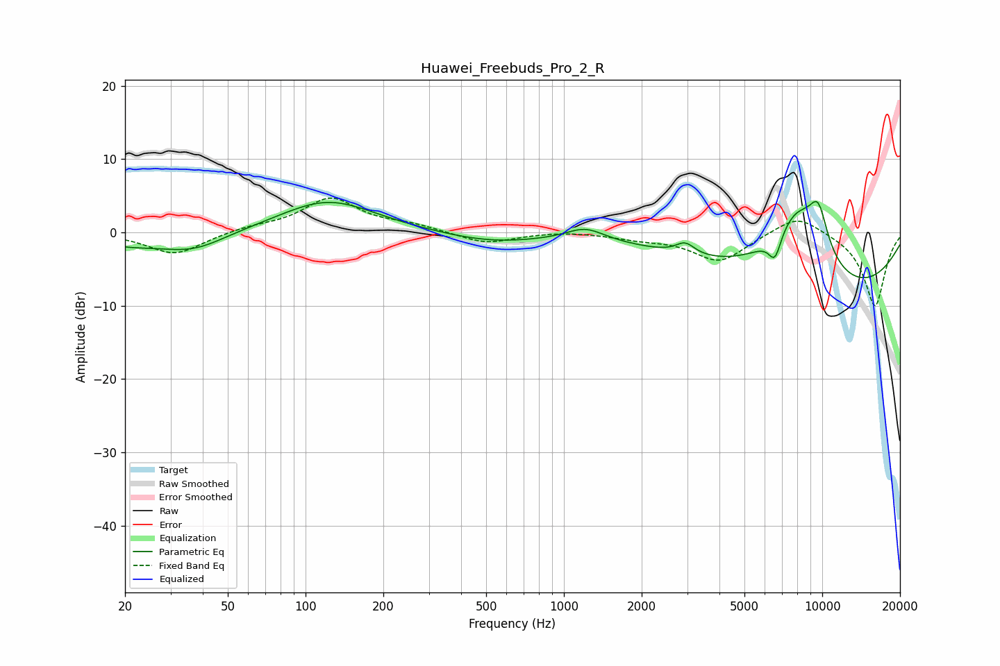

# Huawei_Freebuds_Pro_2_R
See [usage instructions](https://github.com/jaakkopasanen/AutoEq#usage) for more options and info.

### Parametric EQs
Apply preamp of -4.3 dB when using parametric equalizer.

|   # | Type    |   Fc (Hz) |    Q |   Gain (dB) |
|-----|---------|-----------|------|-------------|
|   1 | Peaking |        20 | 0.85 |        -1.5 |
|   2 | Peaking |        37 | 1.14 |        -2.2 |
|   3 | Peaking |       122 | 0.76 |         4.5 |
|   4 | Peaking |       522 | 0.74 |        -1.3 |
|   5 | Peaking |      1211 | 1.94 |         1.7 |
|   6 | Peaking |      2948 | 3.84 |         1.6 |
|   7 | Peaking |      6560 | 5.51 |        -3.4 |
|   8 | Peaking |      7979 | 1.12 |        10.9 |
|   9 | Peaking |      9658 | 3.3  |         5.8 |
|  10 | Peaking |     10000 | 0.29 |        -9.7 |

### Fixed Band EQs
When using fixed band (also called graphic) equalizer, apply preamp of **-4.8 dB** (if available) and set gains manually with these parameters.

|   # | Type    |   Fc (Hz) |    Q |   Gain (dB) |
|-----|---------|-----------|------|-------------|
|   1 | Peaking |        31 | 1.41 |        -3   |
|   2 | Peaking |        62 | 1.41 |         0.6 |
|   3 | Peaking |       125 | 1.41 |         4.6 |
|   4 | Peaking |       250 | 1.41 |         0.9 |
|   5 | Peaking |       500 | 1.41 |        -1.6 |
|   6 | Peaking |      1000 | 1.41 |         0.2 |
|   7 | Peaking |      2000 | 1.41 |        -0.7 |
|   8 | Peaking |      4000 | 1.41 |        -3.9 |
|   9 | Peaking |      8000 | 1.41 |         2.7 |
|  10 | Peaking |     16000 | 1.41 |       -10.1 |

### Graphs

