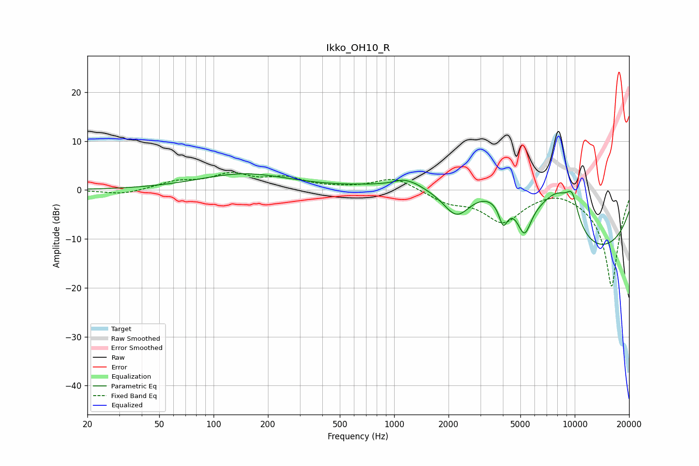

# Ikko_OH10_R
See [usage instructions](https://github.com/jaakkopasanen/AutoEq#usage) for more options and info.

### Parametric EQs
Apply preamp of -3.4 dB when using parametric equalizer.

|   # | Type    |   Fc (Hz) |    Q |   Gain (dB) |
|-----|---------|-----------|------|-------------|
|   1 | Peaking |       147 | 0.56 |         3.2 |
|   2 | Peaking |      1134 | 2.64 |         1.2 |
|   3 | Peaking |      1320 | 4.2  |         0.3 |
|   4 | Peaking |      2216 | 1.65 |        -7.4 |
|   5 | Peaking |      2908 | 0.44 |         9.1 |
|   6 | Peaking |      4019 | 5.7  |        -4.8 |
|   7 | Peaking |      5265 | 3.55 |        -6.7 |
|   8 | Peaking |      8185 | 0.93 |        13.4 |
|   9 | Peaking |      9690 | 3.78 |         5   |
|  10 | Peaking |      9837 | 0.27 |       -18.9 |

### Fixed Band EQs
When using fixed band (also called graphic) equalizer, apply preamp of **-3.7 dB** (if available) and set gains manually with these parameters.

|   # | Type    |   Fc (Hz) |    Q |   Gain (dB) |
|-----|---------|-----------|------|-------------|
|   1 | Peaking |        31 | 1.41 |        -1   |
|   2 | Peaking |        62 | 1.41 |         1.6 |
|   3 | Peaking |       125 | 1.41 |         2.9 |
|   4 | Peaking |       250 | 1.41 |         2.2 |
|   5 | Peaking |       500 | 1.41 |         0.2 |
|   6 | Peaking |      1000 | 1.41 |         2.6 |
|   7 | Peaking |      2000 | 1.41 |        -2.2 |
|   8 | Peaking |      4000 | 1.41 |        -6.2 |
|   9 | Peaking |      8000 | 1.41 |         1.1 |
|  10 | Peaking |     16000 | 1.41 |       -19.9 |

### Graphs

