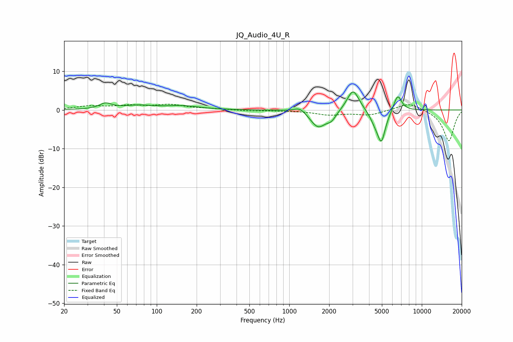

# JQ_Audio_4U_R
See [usage instructions](https://github.com/jaakkopasanen/AutoEq#usage) for more options and info.

### Parametric EQs
Apply preamp of -4.7 dB when using parametric equalizer.

|   # | Type    |   Fc (Hz) |    Q |   Gain (dB) |
|-----|---------|-----------|------|-------------|
|   1 | Peaking |        41 | 3.07 |         1.4 |
|   2 | Peaking |        73 | 1.21 |         1   |
|   3 | Peaking |       156 | 1.15 |         0.9 |
|   4 | Peaking |      1207 | 3.03 |         1.5 |
|   5 | Peaking |      1649 | 2.3  |        -4.6 |
|   6 | Peaking |      2082 | 4    |        -1.8 |
|   7 | Peaking |      3029 | 3.07 |         5.7 |
|   8 | Peaking |      4420 | 3.72 |        -2   |
|   9 | Peaking |      4953 | 4.39 |        -7.8 |
|  10 | Peaking |      6576 | 4.46 |         4.3 |

### Fixed Band EQs
When using fixed band (also called graphic) equalizer, apply preamp of **-1.6 dB** (if available) and set gains manually with these parameters.

|   # | Type    |   Fc (Hz) |    Q |   Gain (dB) |
|-----|---------|-----------|------|-------------|
|   1 | Peaking |        31 | 1.41 |         0.9 |
|   2 | Peaking |        62 | 1.41 |         0.9 |
|   3 | Peaking |       125 | 1.41 |         1.2 |
|   4 | Peaking |       250 | 1.41 |         0.3 |
|   5 | Peaking |       500 | 1.41 |        -0.2 |
|   6 | Peaking |      1000 | 1.41 |        -0.1 |
|   7 | Peaking |      2000 | 1.41 |        -1.2 |
|   8 | Peaking |      4000 | 1.41 |        -1.3 |
|   9 | Peaking |      8000 | 1.41 |         2   |
|  10 | Peaking |     16000 | 1.41 |        -8.1 |

### Graphs

