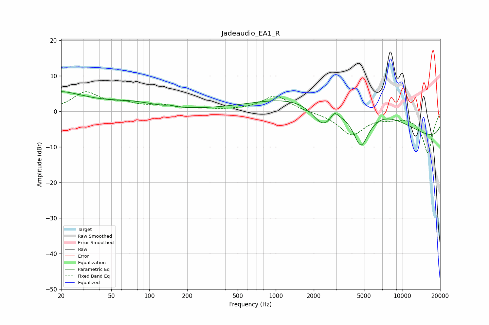

# Jadeaudio_EA1_R
See [usage instructions](https://github.com/jaakkopasanen/AutoEq#usage) for more options and info.

### Parametric EQs
Apply preamp of -5.6 dB when using parametric equalizer.

|   # | Type    |   Fc (Hz) |    Q |   Gain (dB) |
|-----|---------|-----------|------|-------------|
|   1 | Peaking |        20 | 5.34 |         0.2 |
|   2 | Peaking |        20 | 1.66 |         0.9 |
|   3 | Peaking |        22 | 0.69 |         4   |
|   4 | Peaking |        71 | 0.7  |         2.1 |
|   5 | Peaking |       146 | 5.96 |         0.4 |
|   6 | Peaking |      2359 | 1.55 |        -7.3 |
|   7 | Peaking |      2915 | 5.32 |         1.8 |
|   8 | Peaking |      4719 | 1.69 |       -14.4 |
|   9 | Peaking |      4835 | 0.28 |        18   |
|  10 | Peaking |     10000 | 0.18 |       -14.4 |

### Fixed Band EQs
When using fixed band (also called graphic) equalizer, apply preamp of **-5.6 dB** (if available) and set gains manually with these parameters.

|   # | Type    |   Fc (Hz) |    Q |   Gain (dB) |
|-----|---------|-----------|------|-------------|
|   1 | Peaking |        31 | 1.41 |         5.1 |
|   2 | Peaking |        62 | 1.41 |         1.8 |
|   3 | Peaking |       125 | 1.41 |         1.4 |
|   4 | Peaking |       250 | 1.41 |         0.5 |
|   5 | Peaking |       500 | 1.41 |         0.2 |
|   6 | Peaking |      1000 | 1.41 |         4.5 |
|   7 | Peaking |      2000 | 1.41 |        -0.2 |
|   8 | Peaking |      4000 | 1.41 |        -6.4 |
|   9 | Peaking |      8000 | 1.41 |        -1.1 |
|  10 | Peaking |     16000 | 1.41 |       -11.6 |

### Graphs

