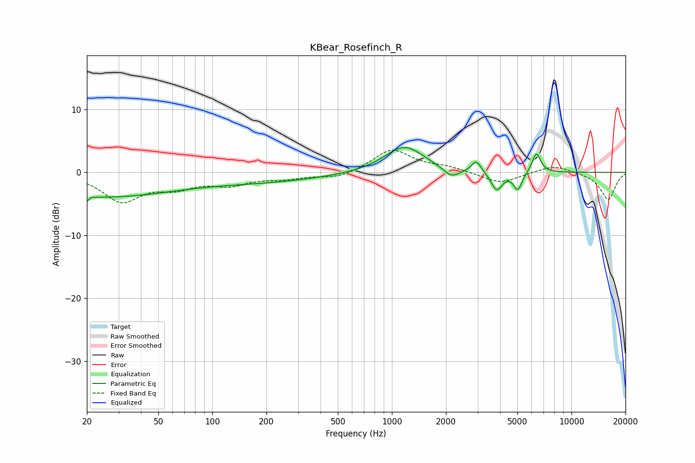

# KBear_Rosefinch_R
See [usage instructions](https://github.com/jaakkopasanen/AutoEq#usage) for more options and info.

### Parametric EQs
Apply preamp of -4.1 dB when using parametric equalizer.

|   # | Type    |   Fc (Hz) |    Q |   Gain (dB) |
|-----|---------|-----------|------|-------------|
|   1 | Peaking |        20 | 5.91 |        -3.9 |
|   2 | Peaking |        20 | 6    |         3.1 |
|   3 | Peaking |        25 | 0.35 |        -3.8 |
|   4 | Peaking |       200 | 0.41 |        -1.3 |
|   5 | Peaking |      1173 | 1.28 |         4.3 |
|   6 | Peaking |      2146 | 3.12 |        -1.5 |
|   7 | Peaking |      2950 | 5.46 |         1.9 |
|   8 | Peaking |      3836 | 4.55 |        -2.9 |
|   9 | Peaking |      5026 | 5.9  |        -2.8 |
|  10 | Peaking |      6378 | 5.82 |         3.2 |

### Fixed Band EQs
When using fixed band (also called graphic) equalizer, apply preamp of **-3.6 dB** (if available) and set gains manually with these parameters.

|   # | Type    |   Fc (Hz) |    Q |   Gain (dB) |
|-----|---------|-----------|------|-------------|
|   1 | Peaking |        31 | 1.41 |        -4.4 |
|   2 | Peaking |        62 | 1.41 |        -2   |
|   3 | Peaking |       125 | 1.41 |        -1.7 |
|   4 | Peaking |       250 | 1.41 |        -0.8 |
|   5 | Peaking |       500 | 1.41 |        -1   |
|   6 | Peaking |      1000 | 1.41 |         3.7 |
|   7 | Peaking |      2000 | 1.41 |         0.8 |
|   8 | Peaking |      4000 | 1.41 |        -1.8 |
|   9 | Peaking |      8000 | 1.41 |         1.2 |
|  10 | Peaking |     16000 | 1.41 |        -4.3 |

### Graphs

