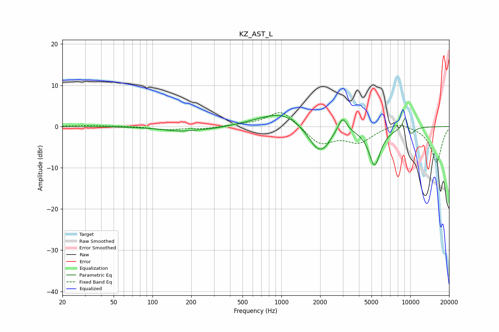

# KZ_AST_L
See [usage instructions](https://github.com/jaakkopasanen/AutoEq#usage) for more options and info.

### Parametric EQs
Apply preamp of -2.8 dB when using parametric equalizer.

|   # | Type    |   Fc (Hz) |    Q |   Gain (dB) |
|-----|---------|-----------|------|-------------|
|   1 | Peaking |       168 | 0.93 |        -1.1 |
|   2 | Peaking |       305 | 1.35 |        -0.3 |
|   3 | Peaking |       735 | 0.86 |         1   |
|   4 | Peaking |      1042 | 1.07 |         2.7 |
|   5 | Peaking |      1926 | 1.84 |        -5.9 |
|   6 | Peaking |      2198 | 3.99 |        -1.1 |
|   7 | Peaking |      2978 | 4.37 |         3.6 |
|   8 | Peaking |      5288 | 2.98 |        -9.2 |
|   9 | Peaking |      9176 | 6    |         3.8 |
|  10 | Peaking |     10000 | 4.18 |        -2.3 |

### Fixed Band EQs
When using fixed band (also called graphic) equalizer, apply preamp of **-3.4 dB** (if available) and set gains manually with these parameters.

|   # | Type    |   Fc (Hz) |    Q |   Gain (dB) |
|-----|---------|-----------|------|-------------|
|   1 | Peaking |        31 | 1.41 |         0.3 |
|   2 | Peaking |        62 | 1.41 |         0.1 |
|   3 | Peaking |       125 | 1.41 |        -0.7 |
|   4 | Peaking |       250 | 1.41 |        -0.5 |
|   5 | Peaking |       500 | 1.41 |         0.3 |
|   6 | Peaking |      1000 | 1.41 |         4.2 |
|   7 | Peaking |      2000 | 1.41 |        -4.2 |
|   8 | Peaking |      4000 | 1.41 |        -3.5 |
|   9 | Peaking |      8000 | 1.41 |         1.4 |
|  10 | Peaking |     16000 | 1.41 |        -8.7 |

### Graphs

