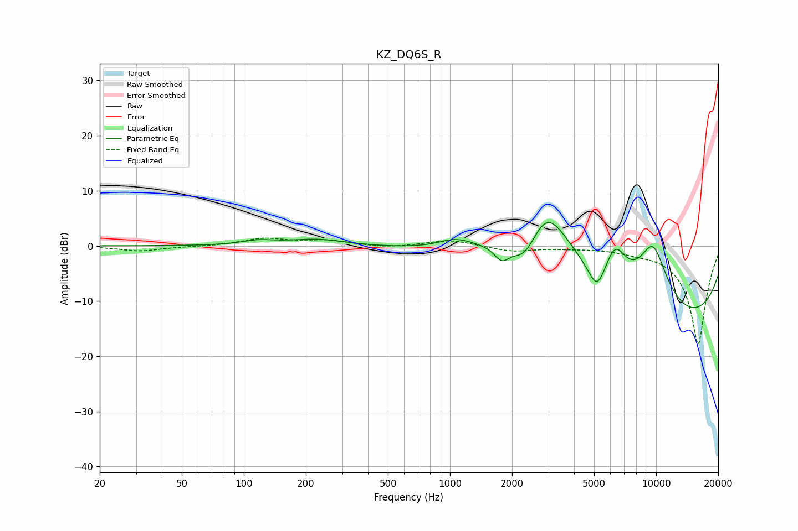

# KZ_DQ6S_R
See [usage instructions](https://github.com/jaakkopasanen/AutoEq#usage) for more options and info.

### Parametric EQs
Apply preamp of -4.3 dB when using parametric equalizer.

|   # | Type    |   Fc (Hz) |    Q |   Gain (dB) |
|-----|---------|-----------|------|-------------|
|   1 | Peaking |       117 | 1.84 |         0.8 |
|   2 | Peaking |       227 | 1.03 |         1.2 |
|   3 | Peaking |      1062 | 1.72 |         1.7 |
|   4 | Peaking |      1782 | 3.81 |        -2.8 |
|   5 | Peaking |      2315 | 2.1  |        -5.6 |
|   6 | Peaking |      2931 | 0.76 |        18.9 |
|   7 | Peaking |      5171 | 3.3  |        -5   |
|   8 | Peaking |      6322 | 2.44 |         6.9 |
|   9 | Peaking |      8683 | 0.19 |       -18.9 |
|  10 | Peaking |      9639 | 1.32 |        14.6 |

### Fixed Band EQs
When using fixed band (also called graphic) equalizer, apply preamp of **-1.5 dB** (if available) and set gains manually with these parameters.

|   # | Type    |   Fc (Hz) |    Q |   Gain (dB) |
|-----|---------|-----------|------|-------------|
|   1 | Peaking |        31 | 1.41 |        -0.9 |
|   2 | Peaking |        62 | 1.41 |        -0.1 |
|   3 | Peaking |       125 | 1.41 |         1.3 |
|   4 | Peaking |       250 | 1.41 |         0.9 |
|   5 | Peaking |       500 | 1.41 |        -0.4 |
|   6 | Peaking |      1000 | 1.41 |         1.1 |
|   7 | Peaking |      2000 | 1.41 |        -1   |
|   8 | Peaking |      4000 | 1.41 |        -0.2 |
|   9 | Peaking |      8000 | 1.41 |        -0.5 |
|  10 | Peaking |     16000 | 1.41 |       -17.9 |

### Graphs

