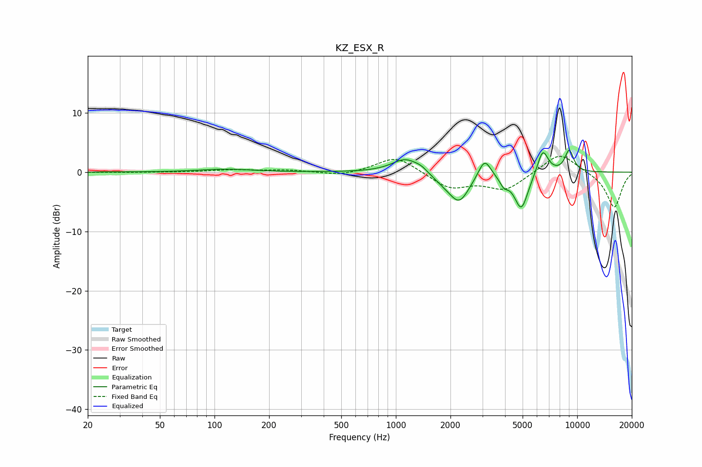

# KZ_ESX_R
See [usage instructions](https://github.com/jaakkopasanen/AutoEq#usage) for more options and info.

### Parametric EQs
Apply preamp of -3.8 dB when using parametric equalizer.

|   # | Type    |   Fc (Hz) |    Q |   Gain (dB) |
|-----|---------|-----------|------|-------------|
|   1 | Peaking |       115 | 0.99 |         0.5 |
|   2 | Peaking |      1134 | 1.88 |         2.5 |
|   3 | Peaking |      1388 | 4.01 |         0.6 |
|   4 | Peaking |      1848 | 1.93 |        -1.3 |
|   5 | Peaking |      2242 | 2.58 |        -4.5 |
|   6 | Peaking |      3086 | 4.18 |         3.3 |
|   7 | Peaking |      3944 | 6    |        -1.4 |
|   8 | Peaking |      4917 | 3.56 |        -6.2 |
|   9 | Peaking |      6455 | 4.48 |         4.2 |
|  10 | Peaking |      9041 | 5.19 |         3.7 |

### Fixed Band EQs
When using fixed band (also called graphic) equalizer, apply preamp of **-2.8 dB** (if available) and set gains manually with these parameters.

|   # | Type    |   Fc (Hz) |    Q |   Gain (dB) |
|-----|---------|-----------|------|-------------|
|   1 | Peaking |        31 | 1.41 |        -0.1 |
|   2 | Peaking |        62 | 1.41 |         0   |
|   3 | Peaking |       125 | 1.41 |         0.4 |
|   4 | Peaking |       250 | 1.41 |         0.3 |
|   5 | Peaking |       500 | 1.41 |        -0.7 |
|   6 | Peaking |      1000 | 1.41 |         2.8 |
|   7 | Peaking |      2000 | 1.41 |        -2.7 |
|   8 | Peaking |      4000 | 1.41 |        -2.9 |
|   9 | Peaking |      8000 | 1.41 |         3.5 |
|  10 | Peaking |     16000 | 1.41 |        -6   |

### Graphs

