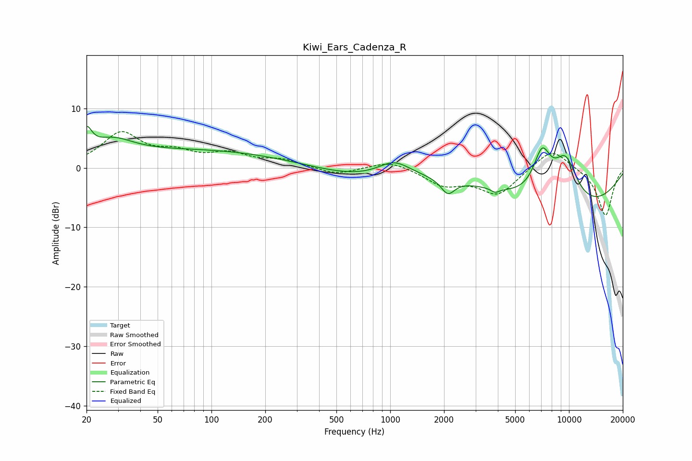

# Kiwi_Ears_Cadenza_R
See [usage instructions](https://github.com/jaakkopasanen/AutoEq#usage) for more options and info.

### Parametric EQs
Apply preamp of -7.0 dB when using parametric equalizer.

|   # | Type    |   Fc (Hz) |    Q |   Gain (dB) |
|-----|---------|-----------|------|-------------|
|   1 | Peaking |        20 | 4.83 |         3.8 |
|   2 | Peaking |        28 | 1.18 |         3.1 |
|   3 | Peaking |        89 | 0.29 |         2.9 |
|   4 | Peaking |       722 | 0.53 |        -1.8 |
|   5 | Peaking |      1051 | 1.53 |         2.7 |
|   6 | Peaking |      2100 | 3.69 |        -2.5 |
|   7 | Peaking |      3865 | 6    |        -0.7 |
|   8 | Peaking |      7073 | 2.65 |         7.3 |
|   9 | Peaking |      9562 | 1.73 |         8   |
|  10 | Peaking |      9894 | 0.33 |        -7.5 |

### Fixed Band EQs
When using fixed band (also called graphic) equalizer, apply preamp of **-6.2 dB** (if available) and set gains manually with these parameters.

|   # | Type    |   Fc (Hz) |    Q |   Gain (dB) |
|-----|---------|-----------|------|-------------|
|   1 | Peaking |        31 | 1.41 |         5.6 |
|   2 | Peaking |        62 | 1.41 |         2.1 |
|   3 | Peaking |       125 | 1.41 |         2.1 |
|   4 | Peaking |       250 | 1.41 |         1.2 |
|   5 | Peaking |       500 | 1.41 |        -1.2 |
|   6 | Peaking |      1000 | 1.41 |         1.3 |
|   7 | Peaking |      2000 | 1.41 |        -2.7 |
|   8 | Peaking |      4000 | 1.41 |        -4.4 |
|   9 | Peaking |      8000 | 1.41 |         3.6 |
|  10 | Peaking |     16000 | 1.41 |        -8.1 |

### Graphs

