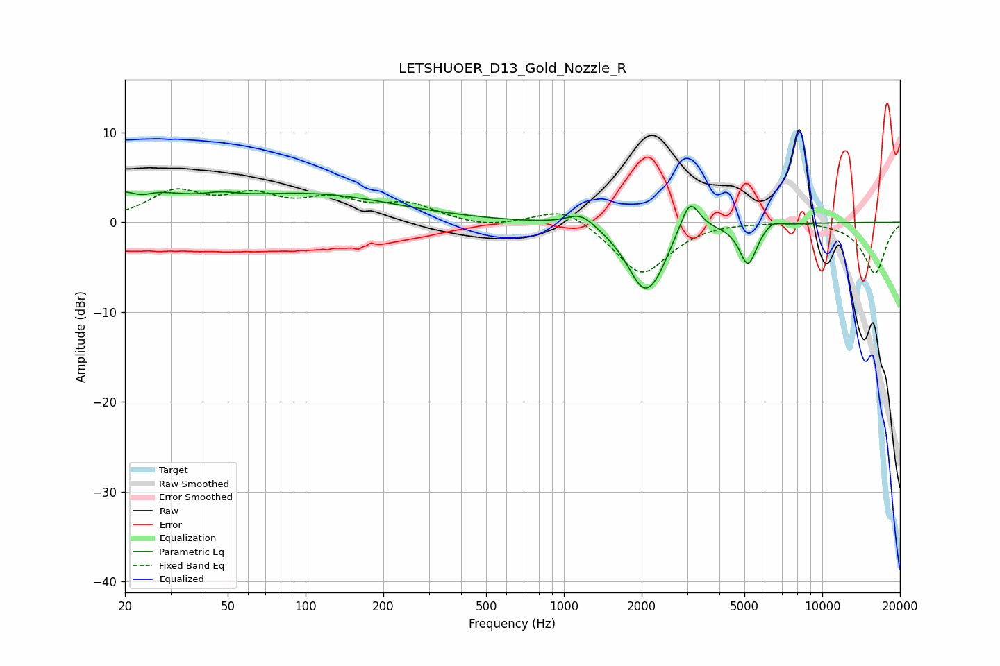

# LETSHUOER_D13_Gold_Nozzle_R
See [usage instructions](https://github.com/jaakkopasanen/AutoEq#usage) for more options and info.

### Parametric EQs
Apply preamp of -3.5 dB when using parametric equalizer.

|   # | Type    |   Fc (Hz) |    Q |   Gain (dB) |
|-----|---------|-----------|------|-------------|
|   1 | Peaking |        21 | 0.93 |         3.3 |
|   2 | Peaking |        23 | 3.4  |        -0.9 |
|   3 | Peaking |        47 | 2.09 |         0.6 |
|   4 | Peaking |       105 | 0.43 |         3   |
|   5 | Peaking |      1166 | 2.53 |         1.5 |
|   6 | Peaking |      2047 | 2.07 |        -7.2 |
|   7 | Peaking |      2333 | 3.62 |        -1.1 |
|   8 | Peaking |      3073 | 3.8  |         3.9 |
|   9 | Peaking |      5162 | 4.16 |        -4.6 |
|  10 | Peaking |      6404 | 4.14 |         0.7 |

### Fixed Band EQs
When using fixed band (also called graphic) equalizer, apply preamp of **-3.8 dB** (if available) and set gains manually with these parameters.

|   # | Type    |   Fc (Hz) |    Q |   Gain (dB) |
|-----|---------|-----------|------|-------------|
|   1 | Peaking |        31 | 1.41 |         3.2 |
|   2 | Peaking |        62 | 1.41 |         2.5 |
|   3 | Peaking |       125 | 1.41 |         2.2 |
|   4 | Peaking |       250 | 1.41 |         1.8 |
|   5 | Peaking |       500 | 1.41 |        -0.6 |
|   6 | Peaking |      1000 | 1.41 |         2   |
|   7 | Peaking |      2000 | 1.41 |        -5.9 |
|   8 | Peaking |      4000 | 1.41 |         0.2 |
|   9 | Peaking |      8000 | 1.41 |         0.3 |
|  10 | Peaking |     16000 | 1.41 |        -5.7 |

### Graphs

