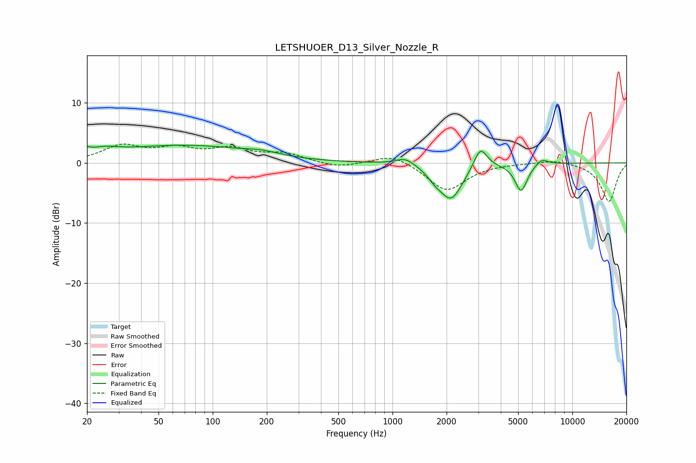

# LETSHUOER_D13_Silver_Nozzle_R
See [usage instructions](https://github.com/jaakkopasanen/AutoEq#usage) for more options and info.

### Parametric EQs
Apply preamp of -3.0 dB when using parametric equalizer.

|   # | Type    |   Fc (Hz) |    Q |   Gain (dB) |
|-----|---------|-----------|------|-------------|
|   1 | Peaking |        20 | 1.46 |         2.7 |
|   2 | Peaking |        22 | 3.09 |        -1.2 |
|   3 | Peaking |        71 | 0.4  |         2.8 |
|   4 | Peaking |       188 | 1.49 |         0.6 |
|   5 | Peaking |      1180 | 2.69 |         1.3 |
|   6 | Peaking |      1719 | 3.64 |        -1   |
|   7 | Peaking |      2118 | 2.16 |        -6   |
|   8 | Peaking |      3084 | 3.82 |         3.7 |
|   9 | Peaking |      5194 | 4.13 |        -4.6 |
|  10 | Peaking |      6762 | 3.98 |         1.1 |

### Fixed Band EQs
When using fixed band (also called graphic) equalizer, apply preamp of **-3.2 dB** (if available) and set gains manually with these parameters.

|   # | Type    |   Fc (Hz) |    Q |   Gain (dB) |
|-----|---------|-----------|------|-------------|
|   1 | Peaking |        31 | 1.41 |         2.7 |
|   2 | Peaking |        62 | 1.41 |         2   |
|   3 | Peaking |       125 | 1.41 |         2.1 |
|   4 | Peaking |       250 | 1.41 |         1.4 |
|   5 | Peaking |       500 | 1.41 |        -0.9 |
|   6 | Peaking |      1000 | 1.41 |         1.6 |
|   7 | Peaking |      2000 | 1.41 |        -4.7 |
|   8 | Peaking |      4000 | 1.41 |         0   |
|   9 | Peaking |      8000 | 1.41 |         0.6 |
|  10 | Peaking |     16000 | 1.41 |        -6.5 |

### Graphs

