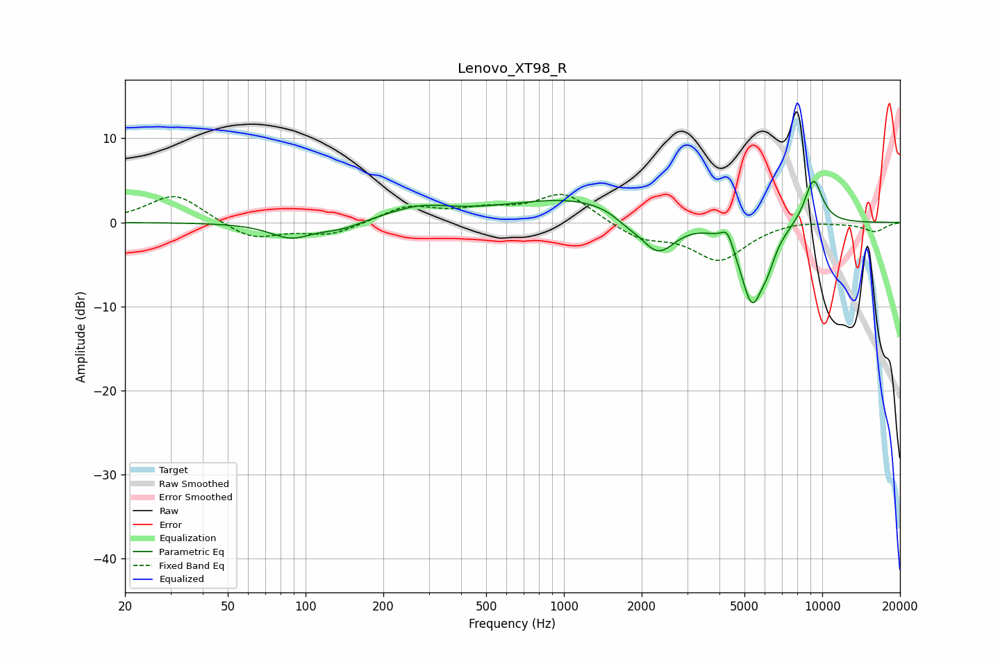

# Lenovo_XT98_R
See [usage instructions](https://github.com/jaakkopasanen/AutoEq#usage) for more options and info.

### Parametric EQs
Apply preamp of -5.0 dB when using parametric equalizer.

|   # | Type    |   Fc (Hz) |    Q |   Gain (dB) |
|-----|---------|-----------|------|-------------|
|   1 | Peaking |        88 | 1.75 |        -1.8 |
|   2 | Peaking |       137 | 1.76 |        -0.9 |
|   3 | Peaking |       274 | 1.13 |         1.5 |
|   4 | Peaking |      1164 | 0.49 |         3   |
|   5 | Peaking |      1740 | 2.75 |        -0.9 |
|   6 | Peaking |      2308 | 1.95 |        -4.8 |
|   7 | Peaking |      4294 | 5.97 |         2   |
|   8 | Peaking |      5353 | 2.8  |        -9.7 |
|   9 | Peaking |      6158 | 4.83 |        -1.7 |
|  10 | Peaking |      9248 | 3.51 |         5.5 |

### Fixed Band EQs
When using fixed band (also called graphic) equalizer, apply preamp of **-3.4 dB** (if available) and set gains manually with these parameters.

|   # | Type    |   Fc (Hz) |    Q |   Gain (dB) |
|-----|---------|-----------|------|-------------|
|   1 | Peaking |        31 | 1.41 |         3.5 |
|   2 | Peaking |        62 | 1.41 |        -2.1 |
|   3 | Peaking |       125 | 1.41 |        -1.5 |
|   4 | Peaking |       250 | 1.41 |         1.9 |
|   5 | Peaking |       500 | 1.41 |         1.2 |
|   6 | Peaking |      1000 | 1.41 |         3.5 |
|   7 | Peaking |      2000 | 1.41 |        -1.9 |
|   8 | Peaking |      4000 | 1.41 |        -4.4 |
|   9 | Peaking |      8000 | 1.41 |         0.4 |
|  10 | Peaking |     16000 | 1.41 |        -1.1 |

### Graphs

