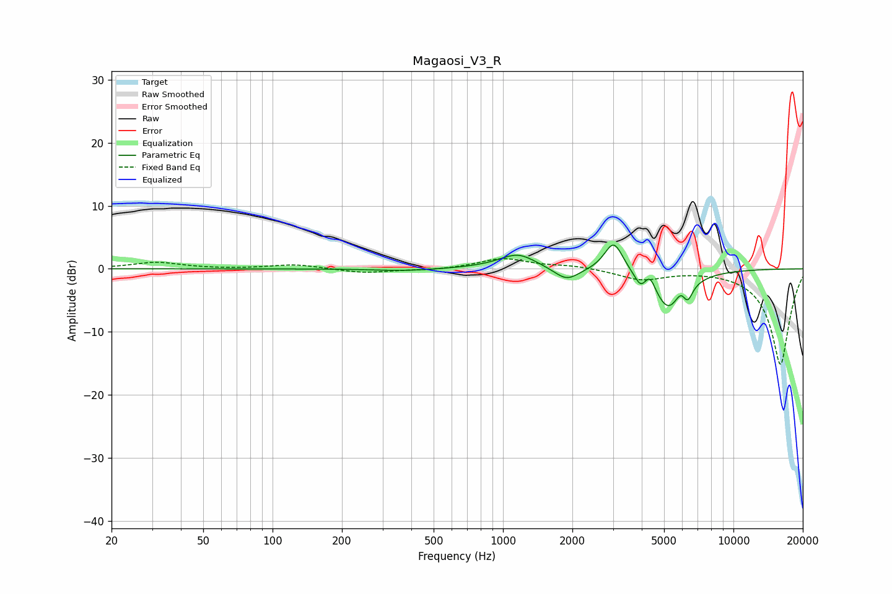

# Magaosi_V3_R
See [usage instructions](https://github.com/jaakkopasanen/AutoEq#usage) for more options and info.

### Parametric EQs
Apply preamp of -3.9 dB when using parametric equalizer.

|   # | Type    |   Fc (Hz) |    Q |   Gain (dB) |
|-----|---------|-----------|------|-------------|
|   1 | Peaking |       372 | 1.13 |        -0.3 |
|   2 | Peaking |      1060 | 1.15 |         0.4 |
|   3 | Peaking |      1166 | 1.89 |         2   |
|   4 | Peaking |      1890 | 2.63 |        -2.1 |
|   5 | Peaking |      3025 | 3.46 |         4.9 |
|   6 | Peaking |      3953 | 6    |        -1.7 |
|   7 | Peaking |      4344 | 6    |         2.2 |
|   8 | Peaking |      5276 | 2.01 |        -7   |
|   9 | Peaking |      6002 | 4.18 |         3   |
|  10 | Peaking |      6297 | 5.98 |        -3.4 |

### Fixed Band EQs
When using fixed band (also called graphic) equalizer, apply preamp of **-1.7 dB** (if available) and set gains manually with these parameters.

|   # | Type    |   Fc (Hz) |    Q |   Gain (dB) |
|-----|---------|-----------|------|-------------|
|   1 | Peaking |        31 | 1.41 |         1   |
|   2 | Peaking |        62 | 1.41 |        -0   |
|   3 | Peaking |       125 | 1.41 |         0.7 |
|   4 | Peaking |       250 | 1.41 |        -0.7 |
|   5 | Peaking |       500 | 1.41 |        -0.2 |
|   6 | Peaking |      1000 | 1.41 |         1.6 |
|   7 | Peaking |      2000 | 1.41 |         0.5 |
|   8 | Peaking |      4000 | 1.41 |        -1.7 |
|   9 | Peaking |      8000 | 1.41 |         0   |
|  10 | Peaking |     16000 | 1.41 |       -15.3 |

### Graphs

