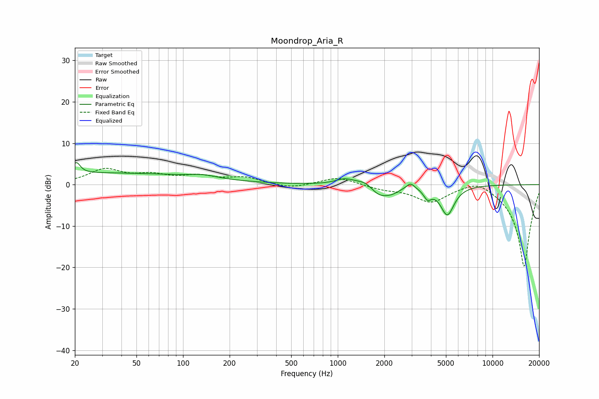

# Moondrop_Aria_R
See [usage instructions](https://github.com/jaakkopasanen/AutoEq#usage) for more options and info.

### Parametric EQs
Apply preamp of -5.4 dB when using parametric equalizer.

|   # | Type    |   Fc (Hz) |    Q |   Gain (dB) |
|-----|---------|-----------|------|-------------|
|   1 | Peaking |        20 | 5.98 |         2.6 |
|   2 | Peaking |        29 | 0.18 |         2.8 |
|   3 | Peaking |       135 | 1.67 |         0.7 |
|   4 | Peaking |      1115 | 2.28 |         1.5 |
|   5 | Peaking |      1516 | 2.56 |         1.5 |
|   6 | Peaking |      1857 | 2.16 |        -2.8 |
|   7 | Peaking |      2256 | 3.14 |        -1   |
|   8 | Peaking |      2955 | 5.52 |         1.4 |
|   9 | Peaking |      3800 | 5.7  |        -2.2 |
|  10 | Peaking |      5106 | 3.12 |        -7.1 |

### Fixed Band EQs
When using fixed band (also called graphic) equalizer, apply preamp of **-4.0 dB** (if available) and set gains manually with these parameters.

|   # | Type    |   Fc (Hz) |    Q |   Gain (dB) |
|-----|---------|-----------|------|-------------|
|   1 | Peaking |        31 | 1.41 |         3.5 |
|   2 | Peaking |        62 | 1.41 |         1.9 |
|   3 | Peaking |       125 | 1.41 |         1.8 |
|   4 | Peaking |       250 | 1.41 |         1.6 |
|   5 | Peaking |       500 | 1.41 |        -1   |
|   6 | Peaking |      1000 | 1.41 |         1.9 |
|   7 | Peaking |      2000 | 1.41 |        -1   |
|   8 | Peaking |      4000 | 1.41 |        -4   |
|   9 | Peaking |      8000 | 1.41 |         2   |
|  10 | Peaking |     16000 | 1.41 |       -20   |

### Graphs

