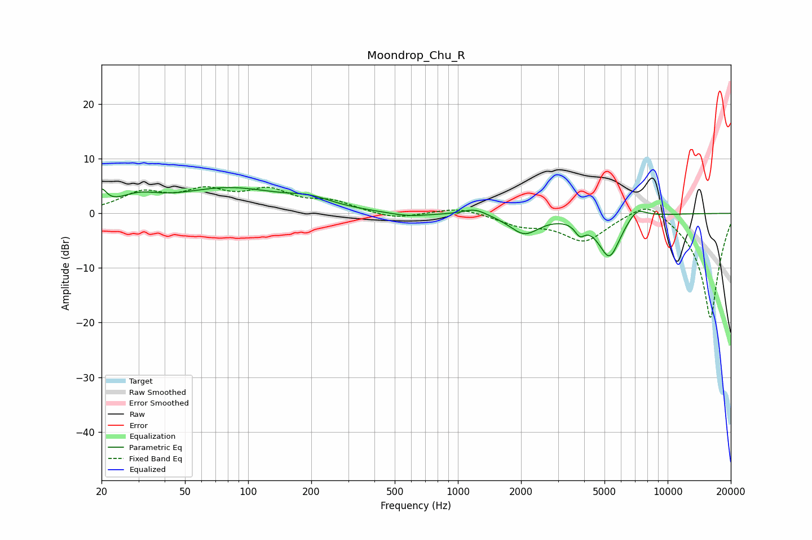

# Moondrop_Chu_R
See [usage instructions](https://github.com/jaakkopasanen/AutoEq#usage) for more options and info.

### Parametric EQs
Apply preamp of -4.8 dB when using parametric equalizer.

|   # | Type    |   Fc (Hz) |    Q |   Gain (dB) |
|-----|---------|-----------|------|-------------|
|   1 | Peaking |        20 | 5.99 |         2.8 |
|   2 | Peaking |        30 | 1.51 |         2.1 |
|   3 | Peaking |        81 | 0.56 |         4.4 |
|   4 | Peaking |       198 | 1.35 |         1.5 |
|   5 | Peaking |       580 | 1.47 |        -0.7 |
|   6 | Peaking |      1204 | 2.55 |         1.2 |
|   7 | Peaking |      2073 | 2.02 |        -3.6 |
|   8 | Peaking |      3814 | 5.98 |        -2.1 |
|   9 | Peaking |      5276 | 2.59 |        -7.9 |
|  10 | Peaking |      7110 | 2.93 |         2.2 |

### Fixed Band EQs
When using fixed band (also called graphic) equalizer, apply preamp of **-5.0 dB** (if available) and set gains manually with these parameters.

|   # | Type    |   Fc (Hz) |    Q |   Gain (dB) |
|-----|---------|-----------|------|-------------|
|   1 | Peaking |        31 | 1.41 |         3.4 |
|   2 | Peaking |        62 | 1.41 |         3.5 |
|   3 | Peaking |       125 | 1.41 |         3.7 |
|   4 | Peaking |       250 | 1.41 |         1.9 |
|   5 | Peaking |       500 | 1.41 |        -1.1 |
|   6 | Peaking |      1000 | 1.41 |         1.2 |
|   7 | Peaking |      2000 | 1.41 |        -1.9 |
|   8 | Peaking |      4000 | 1.41 |        -4.9 |
|   9 | Peaking |      8000 | 1.41 |         3.2 |
|  10 | Peaking |     16000 | 1.41 |       -19.4 |

### Graphs

