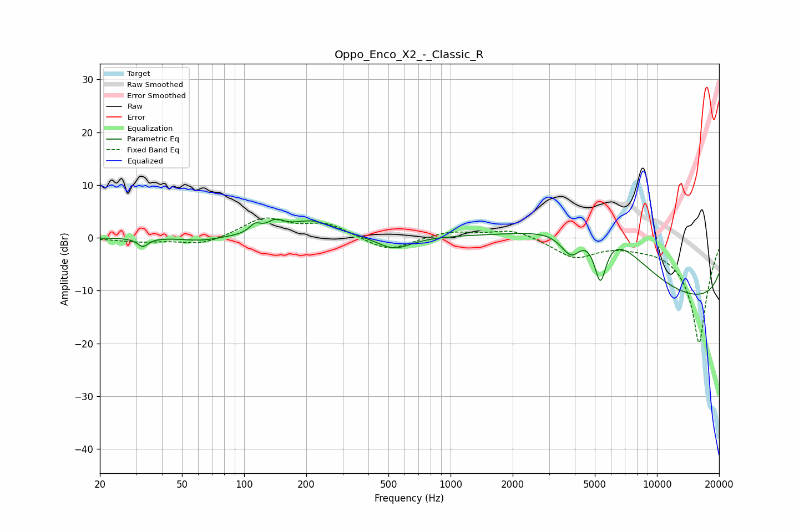

# Oppo_Enco_X2_-_Classic_R
See [usage instructions](https://github.com/jaakkopasanen/AutoEq#usage) for more options and info.

### Parametric EQs
Apply preamp of -3.6 dB when using parametric equalizer.

|   # | Type    |   Fc (Hz) |    Q |   Gain (dB) |
|-----|---------|-----------|------|-------------|
|   1 | Peaking |        32 | 5.76 |        -1.6 |
|   2 | Peaking |        62 | 1.78 |        -0.6 |
|   3 | Peaking |       113 | 5.15 |         1.6 |
|   4 | Peaking |       142 | 3.34 |         2   |
|   5 | Peaking |       214 | 1.29 |         3.1 |
|   6 | Peaking |       532 | 1.72 |        -2.5 |
|   7 | Peaking |      3841 | 2.6  |        -5.4 |
|   8 | Peaking |      5281 | 0.38 |        20   |
|   9 | Peaking |      5315 | 4.29 |       -10   |
|  10 | Peaking |     10000 | 0.18 |       -19.8 |

### Fixed Band EQs
When using fixed band (also called graphic) equalizer, apply preamp of **-3.9 dB** (if available) and set gains manually with these parameters.

|   # | Type    |   Fc (Hz) |    Q |   Gain (dB) |
|-----|---------|-----------|------|-------------|
|   1 | Peaking |        31 | 1.41 |        -0.7 |
|   2 | Peaking |        62 | 1.41 |        -1.4 |
|   3 | Peaking |       125 | 1.41 |         3.6 |
|   4 | Peaking |       250 | 1.41 |         2.5 |
|   5 | Peaking |       500 | 1.41 |        -2.7 |
|   6 | Peaking |      1000 | 1.41 |         1.2 |
|   7 | Peaking |      2000 | 1.41 |         1.7 |
|   8 | Peaking |      4000 | 1.41 |        -3.6 |
|   9 | Peaking |      8000 | 1.41 |        -0.6 |
|  10 | Peaking |     16000 | 1.41 |       -20   |

### Graphs

