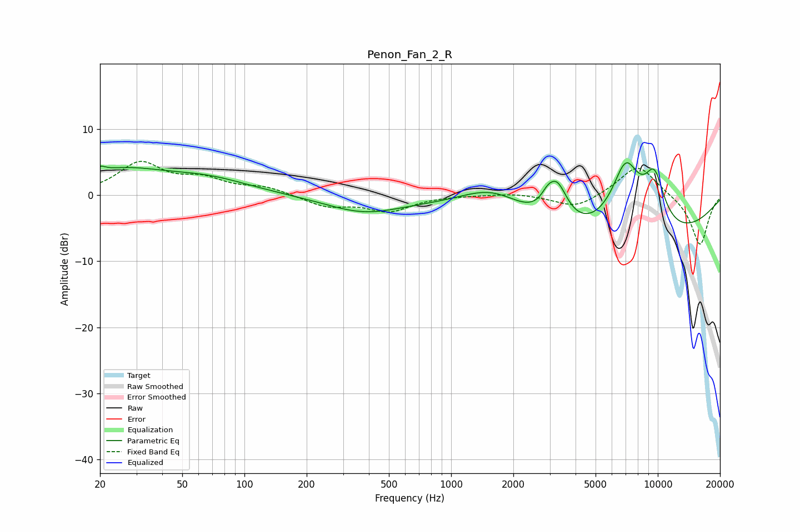

# Penon_Fan_2_R
See [usage instructions](https://github.com/jaakkopasanen/AutoEq#usage) for more options and info.

### Parametric EQs
Apply preamp of -5.0 dB when using parametric equalizer.

|   # | Type    |   Fc (Hz) |    Q |   Gain (dB) |
|-----|---------|-----------|------|-------------|
|   1 | Peaking |        20 | 5.72 |         0.8 |
|   2 | Peaking |        25 | 0.66 |         3.5 |
|   3 | Peaking |        67 | 0.69 |         2.1 |
|   4 | Peaking |       376 | 0.77 |        -2.4 |
|   5 | Peaking |      1606 | 0.82 |         5.1 |
|   6 | Peaking |      2919 | 4.73 |         1.2 |
|   7 | Peaking |      3249 | 2.67 |         6.1 |
|   8 | Peaking |      5870 | 0.22 |        -8.7 |
|   9 | Peaking |      6997 | 1.7  |        11.3 |
|  10 | Peaking |      9634 | 2.41 |         7.7 |

### Fixed Band EQs
When using fixed band (also called graphic) equalizer, apply preamp of **-5.2 dB** (if available) and set gains manually with these parameters.

|   # | Type    |   Fc (Hz) |    Q |   Gain (dB) |
|-----|---------|-----------|------|-------------|
|   1 | Peaking |        31 | 1.41 |         4.7 |
|   2 | Peaking |        62 | 1.41 |         2.1 |
|   3 | Peaking |       125 | 1.41 |         1.1 |
|   4 | Peaking |       250 | 1.41 |        -1.6 |
|   5 | Peaking |       500 | 1.41 |        -2.3 |
|   6 | Peaking |      1000 | 1.41 |         0   |
|   7 | Peaking |      2000 | 1.41 |         0.4 |
|   8 | Peaking |      4000 | 1.41 |        -2   |
|   9 | Peaking |      8000 | 1.41 |         4.8 |
|  10 | Peaking |     16000 | 1.41 |        -7.7 |

### Graphs

