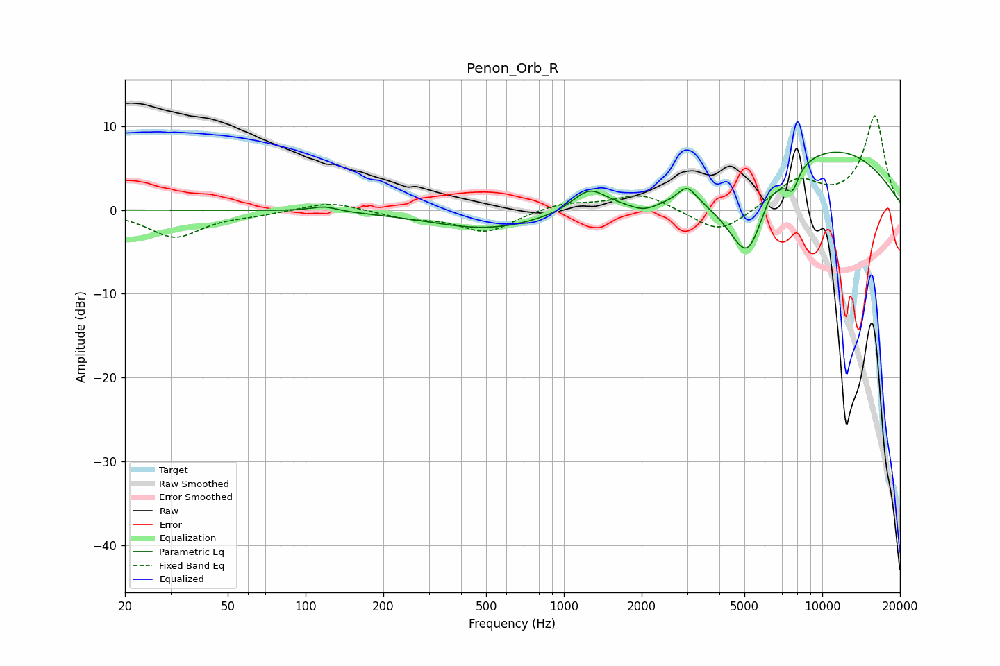

# Penon_Orb_R
See [usage instructions](https://github.com/jaakkopasanen/AutoEq#usage) for more options and info.

### Parametric EQs
Apply preamp of -7.0 dB when using parametric equalizer.

|   # | Type    |   Fc (Hz) |    Q |   Gain (dB) |
|-----|---------|-----------|------|-------------|
|   1 | Peaking |       118 | 2.69 |         0.6 |
|   2 | Peaking |       509 | 0.64 |        -2.3 |
|   3 | Peaking |      1254 | 2.14 |         2.7 |
|   4 | Peaking |      2042 | 2.57 |        -1   |
|   5 | Peaking |      2998 | 3.96 |         2   |
|   6 | Peaking |      4999 | 1.51 |        -7.6 |
|   7 | Peaking |      5195 | 3.07 |        -2.5 |
|   8 | Peaking |      6275 | 6    |         0.8 |
|   9 | Peaking |      7672 | 5.71 |        -2.4 |
|  10 | Peaking |     10000 | 0.35 |         7.7 |

### Fixed Band EQs
When using fixed band (also called graphic) equalizer, apply preamp of **-11.3 dB** (if available) and set gains manually with these parameters.

|   # | Type    |   Fc (Hz) |    Q |   Gain (dB) |
|-----|---------|-----------|------|-------------|
|   1 | Peaking |        31 | 1.41 |        -3.2 |
|   2 | Peaking |        62 | 1.41 |        -0.4 |
|   3 | Peaking |       125 | 1.41 |         1.1 |
|   4 | Peaking |       250 | 1.41 |        -0.8 |
|   5 | Peaking |       500 | 1.41 |        -2.6 |
|   6 | Peaking |      1000 | 1.41 |         0.9 |
|   7 | Peaking |      2000 | 1.41 |         2   |
|   8 | Peaking |      4000 | 1.41 |        -3   |
|   9 | Peaking |      8000 | 1.41 |         3.4 |
|  10 | Peaking |     16000 | 1.41 |        11.1 |

### Graphs

