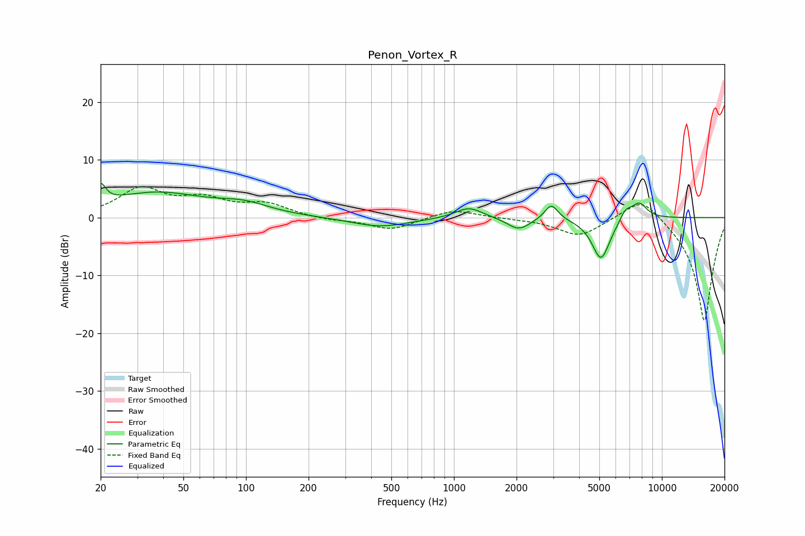

# Penon_Vortex_R
See [usage instructions](https://github.com/jaakkopasanen/AutoEq#usage) for more options and info.

### Parametric EQs
Apply preamp of -6.0 dB when using parametric equalizer.

|   # | Type    |   Fc (Hz) |    Q |   Gain (dB) |
|-----|---------|-----------|------|-------------|
|   1 | Peaking |        20 | 5.88 |         3.2 |
|   2 | Peaking |        37 | 0.59 |         4.2 |
|   3 | Peaking |        98 | 1.18 |         1.6 |
|   4 | Peaking |       441 | 1.02 |        -1.6 |
|   5 | Peaking |      1181 | 2.16 |         1.9 |
|   6 | Peaking |      2049 | 2.61 |        -2.1 |
|   7 | Peaking |      2941 | 4.37 |         2.8 |
|   8 | Peaking |      5094 | 3.16 |        -7.3 |
|   9 | Peaking |      6701 | 4.7  |         1.8 |
|  10 | Peaking |      7779 | 3.49 |         2.7 |

### Fixed Band EQs
When using fixed band (also called graphic) equalizer, apply preamp of **-5.5 dB** (if available) and set gains manually with these parameters.

|   # | Type    |   Fc (Hz) |    Q |   Gain (dB) |
|-----|---------|-----------|------|-------------|
|   1 | Peaking |        31 | 1.41 |         4.8 |
|   2 | Peaking |        62 | 1.41 |         2.7 |
|   3 | Peaking |       125 | 1.41 |         2.1 |
|   4 | Peaking |       250 | 1.41 |        -0.5 |
|   5 | Peaking |       500 | 1.41 |        -2.1 |
|   6 | Peaking |      1000 | 1.41 |         1.5 |
|   7 | Peaking |      2000 | 1.41 |        -0.1 |
|   8 | Peaking |      4000 | 1.41 |        -3.2 |
|   9 | Peaking |      8000 | 1.41 |         4.2 |
|  10 | Peaking |     16000 | 1.41 |       -18.1 |

### Graphs

