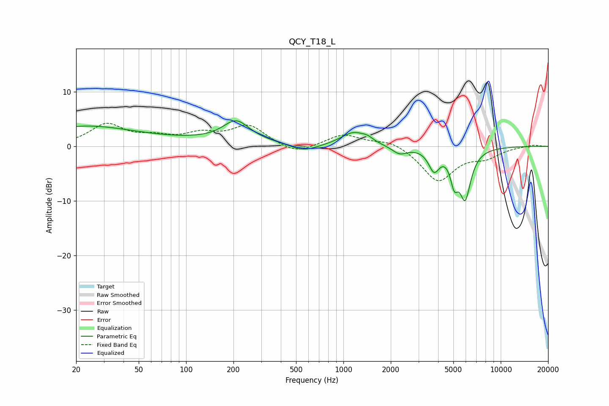

# QCY_T18_L
See [usage instructions](https://github.com/jaakkopasanen/AutoEq#usage) for more options and info.

### Parametric EQs
Apply preamp of -4.8 dB when using parametric equalizer.

|   # | Type    |   Fc (Hz) |    Q |   Gain (dB) |
|-----|---------|-----------|------|-------------|
|   1 | Peaking |        22 | 0.46 |         2.9 |
|   2 | Peaking |        79 | 0.18 |         1   |
|   3 | Peaking |       208 | 1.71 |         3.7 |
|   4 | Peaking |       559 | 1.58 |        -1.4 |
|   5 | Peaking |      1160 | 1.77 |         2.5 |
|   6 | Peaking |      1426 | 3.99 |         0.6 |
|   7 | Peaking |      2275 | 3    |        -1.4 |
|   8 | Peaking |      3769 | 4.1  |        -3.8 |
|   9 | Peaking |      5064 | 5.78 |        -4.5 |
|  10 | Peaking |      5941 | 3.74 |        -8.9 |

### Fixed Band EQs
When using fixed band (also called graphic) equalizer, apply preamp of **-4.3 dB** (if available) and set gains manually with these parameters.

|   # | Type    |   Fc (Hz) |    Q |   Gain (dB) |
|-----|---------|-----------|------|-------------|
|   1 | Peaking |        31 | 1.41 |         3.9 |
|   2 | Peaking |        62 | 1.41 |         1.3 |
|   3 | Peaking |       125 | 1.41 |         1.9 |
|   4 | Peaking |       250 | 1.41 |         3.6 |
|   5 | Peaking |       500 | 1.41 |        -1.6 |
|   6 | Peaking |      1000 | 1.41 |         2.2 |
|   7 | Peaking |      2000 | 1.41 |         1.2 |
|   8 | Peaking |      4000 | 1.41 |        -6.3 |
|   9 | Peaking |      8000 | 1.41 |        -1.7 |
|  10 | Peaking |     16000 | 1.41 |         0.3 |

### Graphs

