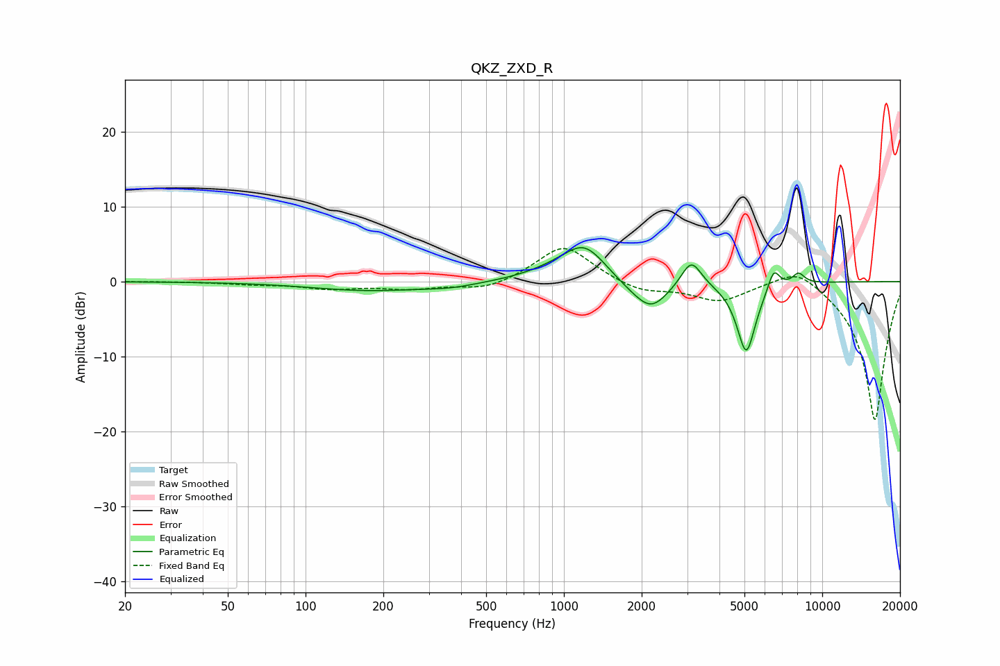

# QKZ_ZXD_R
See [usage instructions](https://github.com/jaakkopasanen/AutoEq#usage) for more options and info.

### Parametric EQs
Apply preamp of -4.6 dB when using parametric equalizer.

|   # | Type    |   Fc (Hz) |    Q |   Gain (dB) |
|-----|---------|-----------|------|-------------|
|   1 | Peaking |       175 | 0.64 |        -1.2 |
|   2 | Peaking |       364 | 1.38 |        -0.5 |
|   3 | Peaking |       913 | 1.2  |         0.9 |
|   4 | Peaking |      1202 | 1.68 |         4.6 |
|   5 | Peaking |      1812 | 1.76 |        -0.9 |
|   6 | Peaking |      2180 | 2.15 |        -3.6 |
|   7 | Peaking |      3114 | 3.63 |         3.6 |
|   8 | Peaking |      5081 | 3.73 |        -9.6 |
|   9 | Peaking |      6489 | 5.9  |         2.9 |
|  10 | Peaking |      8092 | 5.64 |         1.4 |

### Fixed Band EQs
When using fixed band (also called graphic) equalizer, apply preamp of **-4.5 dB** (if available) and set gains manually with these parameters.

|   # | Type    |   Fc (Hz) |    Q |   Gain (dB) |
|-----|---------|-----------|------|-------------|
|   1 | Peaking |        31 | 1.41 |         0   |
|   2 | Peaking |        62 | 1.41 |        -0.3 |
|   3 | Peaking |       125 | 1.41 |        -0.9 |
|   4 | Peaking |       250 | 1.41 |        -0.9 |
|   5 | Peaking |       500 | 1.41 |        -1.2 |
|   6 | Peaking |      1000 | 1.41 |         5   |
|   7 | Peaking |      2000 | 1.41 |        -1.4 |
|   8 | Peaking |      4000 | 1.41 |        -2.5 |
|   9 | Peaking |      8000 | 1.41 |         2.5 |
|  10 | Peaking |     16000 | 1.41 |       -18.7 |

### Graphs

