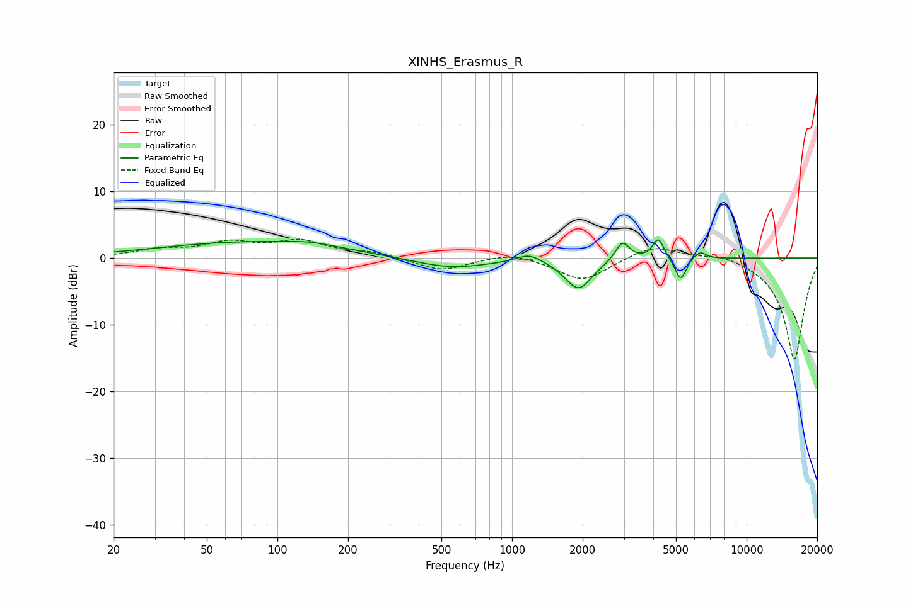

# XINHS_Erasmus_R
See [usage instructions](https://github.com/jaakkopasanen/AutoEq#usage) for more options and info.

### Parametric EQs
Apply preamp of -2.8 dB when using parametric equalizer.

|   # | Type    |   Fc (Hz) |    Q |   Gain (dB) |
|-----|---------|-----------|------|-------------|
|   1 | Peaking |        76 | 0.36 |         2.3 |
|   2 | Peaking |       139 | 1.35 |         0.6 |
|   3 | Peaking |       547 | 0.88 |        -1.6 |
|   4 | Peaking |      1183 | 2.67 |         1.3 |
|   5 | Peaking |      1920 | 2.43 |        -4.6 |
|   6 | Peaking |      2954 | 4.68 |         2.9 |
|   7 | Peaking |      4205 | 5.94 |         3.1 |
|   8 | Peaking |      5240 | 5.78 |        -3.5 |
|   9 | Peaking |      5920 | 5.98 |         0.4 |
|  10 | Peaking |      6387 | 6    |         1   |

### Fixed Band EQs
When using fixed band (also called graphic) equalizer, apply preamp of **-2.9 dB** (if available) and set gains manually with these parameters.

|   # | Type    |   Fc (Hz) |    Q |   Gain (dB) |
|-----|---------|-----------|------|-------------|
|   1 | Peaking |        31 | 1.41 |         1.1 |
|   2 | Peaking |        62 | 1.41 |         2   |
|   3 | Peaking |       125 | 1.41 |         2.3 |
|   4 | Peaking |       250 | 1.41 |         0.8 |
|   5 | Peaking |       500 | 1.41 |        -1.9 |
|   6 | Peaking |      1000 | 1.41 |         1   |
|   7 | Peaking |      2000 | 1.41 |        -3.5 |
|   8 | Peaking |      4000 | 1.41 |         2.1 |
|   9 | Peaking |      8000 | 1.41 |         0.8 |
|  10 | Peaking |     16000 | 1.41 |       -15.4 |

### Graphs

