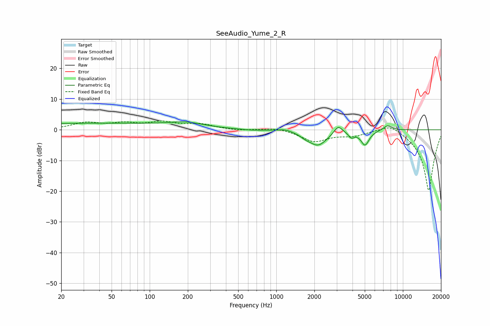

# SeeAudio_Yume_2_R
See [usage instructions](https://github.com/jaakkopasanen/AutoEq#usage) for more options and info.

### Parametric EQs
Apply preamp of -2.7 dB when using parametric equalizer.

|   # | Type    |   Fc (Hz) |    Q |   Gain (dB) |
|-----|---------|-----------|------|-------------|
|   1 | Peaking |        34 | 0.18 |         2.1 |
|   2 | Peaking |       195 | 1.04 |         1.5 |
|   3 | Peaking |       633 | 1.67 |        -0.3 |
|   4 | Peaking |      1172 | 2.9  |         0.7 |
|   5 | Peaking |      1692 | 3.96 |        -0.7 |
|   6 | Peaking |      2131 | 1.88 |        -5   |
|   7 | Peaking |      3081 | 4.24 |         2.7 |
|   8 | Peaking |      3921 | 5.99 |        -1.8 |
|   9 | Peaking |      5024 | 4.25 |        -4.7 |
|  10 | Peaking |      7586 | 3.93 |         1.7 |

### Fixed Band EQs
When using fixed band (also called graphic) equalizer, apply preamp of **-3.0 dB** (if available) and set gains manually with these parameters.

|   # | Type    |   Fc (Hz) |    Q |   Gain (dB) |
|-----|---------|-----------|------|-------------|
|   1 | Peaking |        31 | 1.41 |         2.1 |
|   2 | Peaking |        62 | 1.41 |         1.8 |
|   3 | Peaking |       125 | 1.41 |         2.2 |
|   4 | Peaking |       250 | 1.41 |         1.7 |
|   5 | Peaking |       500 | 1.41 |        -0.3 |
|   6 | Peaking |      1000 | 1.41 |         0.8 |
|   7 | Peaking |      2000 | 1.41 |        -3.7 |
|   8 | Peaking |      4000 | 1.41 |        -1.6 |
|   9 | Peaking |      8000 | 1.41 |         2.6 |
|  10 | Peaking |     16000 | 1.41 |       -20   |

### Graphs

