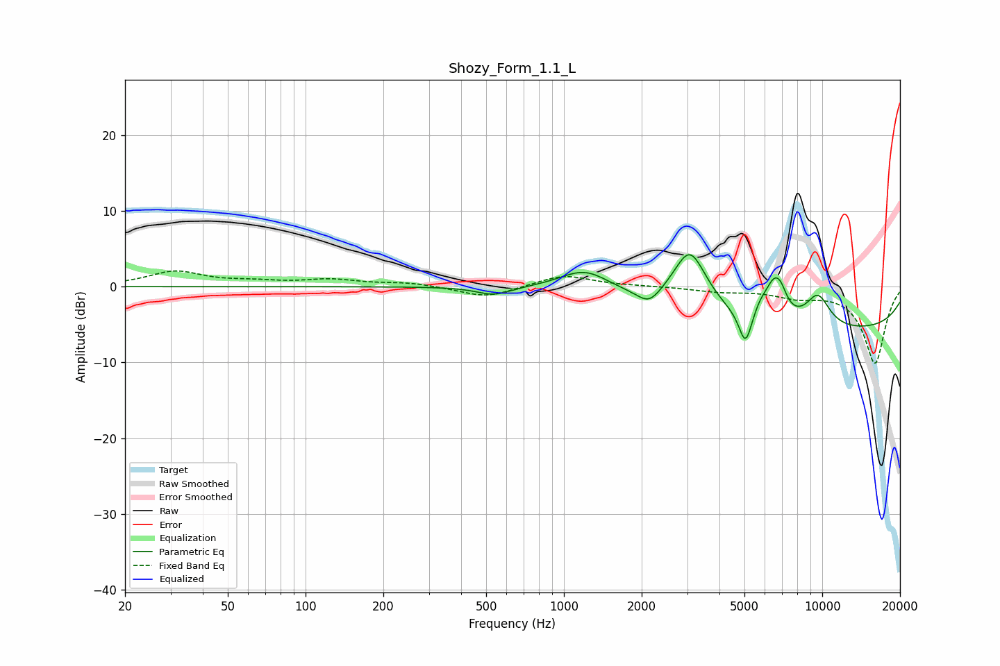

# Shozy_Form_1.1_L
See [usage instructions](https://github.com/jaakkopasanen/AutoEq#usage) for more options and info.

### Parametric EQs
Apply preamp of -4.3 dB when using parametric equalizer.

|   # | Type    |   Fc (Hz) |    Q |   Gain (dB) |
|-----|---------|-----------|------|-------------|
|   1 | Peaking |       536 | 2.18 |        -1.1 |
|   2 | Peaking |      1207 | 1.41 |         3   |
|   3 | Peaking |      2138 | 3.19 |        -1.8 |
|   4 | Peaking |      3074 | 2.08 |         8.2 |
|   5 | Peaking |      5045 | 5.52 |        -4.7 |
|   6 | Peaking |      5755 | 4.34 |         1.5 |
|   7 | Peaking |      6514 | 3.81 |         4.5 |
|   8 | Peaking |      6926 | 5.79 |         1.6 |
|   9 | Peaking |      9619 | 2.57 |         4.2 |
|  10 | Peaking |     10000 | 0.18 |        -5.9 |

### Fixed Band EQs
When using fixed band (also called graphic) equalizer, apply preamp of **-2.2 dB** (if available) and set gains manually with these parameters.

|   # | Type    |   Fc (Hz) |    Q |   Gain (dB) |
|-----|---------|-----------|------|-------------|
|   1 | Peaking |        31 | 1.41 |         1.9 |
|   2 | Peaking |        62 | 1.41 |         0.5 |
|   3 | Peaking |       125 | 1.41 |         0.8 |
|   4 | Peaking |       250 | 1.41 |         0.5 |
|   5 | Peaking |       500 | 1.41 |        -1.5 |
|   6 | Peaking |      1000 | 1.41 |         1.6 |
|   7 | Peaking |      2000 | 1.41 |         0.1 |
|   8 | Peaking |      4000 | 1.41 |        -0.6 |
|   9 | Peaking |      8000 | 1.41 |        -1.1 |
|  10 | Peaking |     16000 | 1.41 |       -10.1 |

### Graphs

