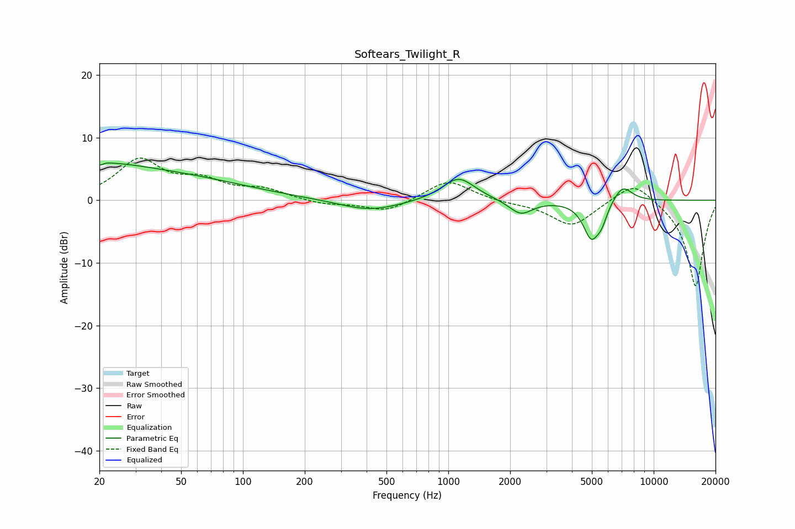

# Softears_Twilight_R
See [usage instructions](https://github.com/jaakkopasanen/AutoEq#usage) for more options and info.

### Parametric EQs
Apply preamp of -6.1 dB when using parametric equalizer.

|   # | Type    |   Fc (Hz) |    Q |   Gain (dB) |
|-----|---------|-----------|------|-------------|
|   1 | Peaking |        21 | 5.99 |        -3.3 |
|   2 | Peaking |        21 | 5.84 |         3.3 |
|   3 | Peaking |        22 | 0.89 |         1.2 |
|   4 | Peaking |        26 | 0.26 |         4.7 |
|   5 | Peaking |       415 | 0.95 |        -1.8 |
|   6 | Peaking |      1122 | 1.76 |         3.8 |
|   7 | Peaking |      2253 | 2.48 |        -2.3 |
|   8 | Peaking |      4970 | 3.48 |        -5.9 |
|   9 | Peaking |      5588 | 5.28 |        -2.1 |
|  10 | Peaking |      7050 | 2.91 |         2.7 |

### Fixed Band EQs
When using fixed band (also called graphic) equalizer, apply preamp of **-6.8 dB** (if available) and set gains manually with these parameters.

|   # | Type    |   Fc (Hz) |    Q |   Gain (dB) |
|-----|---------|-----------|------|-------------|
|   1 | Peaking |        31 | 1.41 |         6.2 |
|   2 | Peaking |        62 | 1.41 |         2.6 |
|   3 | Peaking |       125 | 1.41 |         1.6 |
|   4 | Peaking |       250 | 1.41 |        -0.7 |
|   5 | Peaking |       500 | 1.41 |        -1.9 |
|   6 | Peaking |      1000 | 1.41 |         3.3 |
|   7 | Peaking |      2000 | 1.41 |        -0.4 |
|   8 | Peaking |      4000 | 1.41 |        -4.1 |
|   9 | Peaking |      8000 | 1.41 |         3.4 |
|  10 | Peaking |     16000 | 1.41 |       -13.9 |

### Graphs

