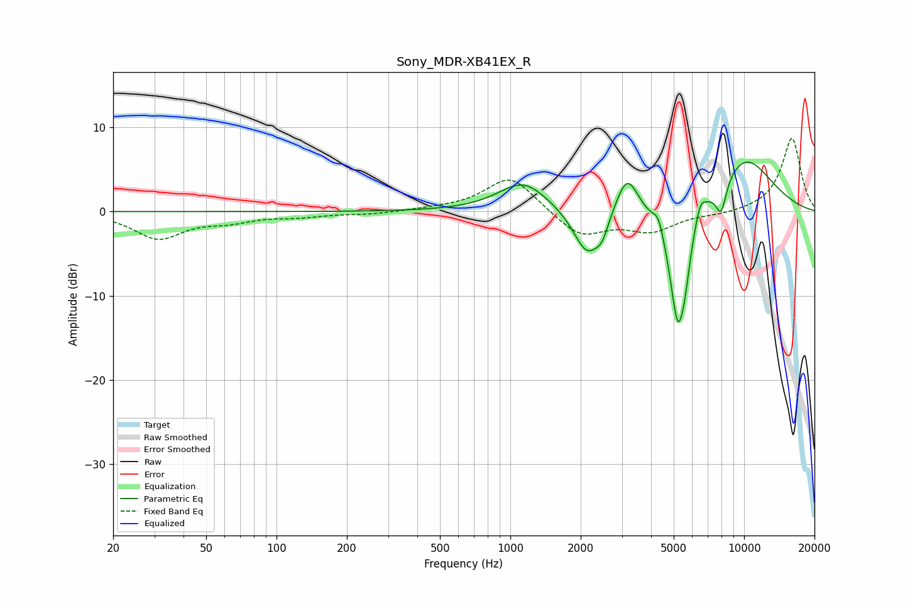

# Sony_MDR-XB41EX_R
See [usage instructions](https://github.com/jaakkopasanen/AutoEq#usage) for more options and info.

### Parametric EQs
Apply preamp of -6.0 dB when using parametric equalizer.

|   # | Type    |   Fc (Hz) |    Q |   Gain (dB) |
|-----|---------|-----------|------|-------------|
|   1 | Peaking |      1136 | 1.34 |         3.6 |
|   2 | Peaking |      2131 | 2.37 |        -5.6 |
|   3 | Peaking |      2468 | 5.11 |        -1.9 |
|   4 | Peaking |      3158 | 2.92 |         4.9 |
|   5 | Peaking |      4301 | 5.96 |         2   |
|   6 | Peaking |      5199 | 3.57 |       -13.9 |
|   7 | Peaking |      5577 | 5.88 |        -3.1 |
|   8 | Peaking |      6492 | 6    |         2.1 |
|   9 | Peaking |      7974 | 5.63 |        -3.7 |
|  10 | Peaking |     10000 | 0.91 |         6.5 |

### Fixed Band EQs
When using fixed band (also called graphic) equalizer, apply preamp of **-8.8 dB** (if available) and set gains manually with these parameters.

|   # | Type    |   Fc (Hz) |    Q |   Gain (dB) |
|-----|---------|-----------|------|-------------|
|   1 | Peaking |        31 | 1.41 |        -3.1 |
|   2 | Peaking |        62 | 1.41 |        -0.9 |
|   3 | Peaking |       125 | 1.41 |        -0.5 |
|   4 | Peaking |       250 | 1.41 |        -0.3 |
|   5 | Peaking |       500 | 1.41 |         0.2 |
|   6 | Peaking |      1000 | 1.41 |         4.3 |
|   7 | Peaking |      2000 | 1.41 |        -3   |
|   8 | Peaking |      4000 | 1.41 |        -2.2 |
|   9 | Peaking |      8000 | 1.41 |        -0.3 |
|  10 | Peaking |     16000 | 1.41 |         8.8 |

### Graphs

