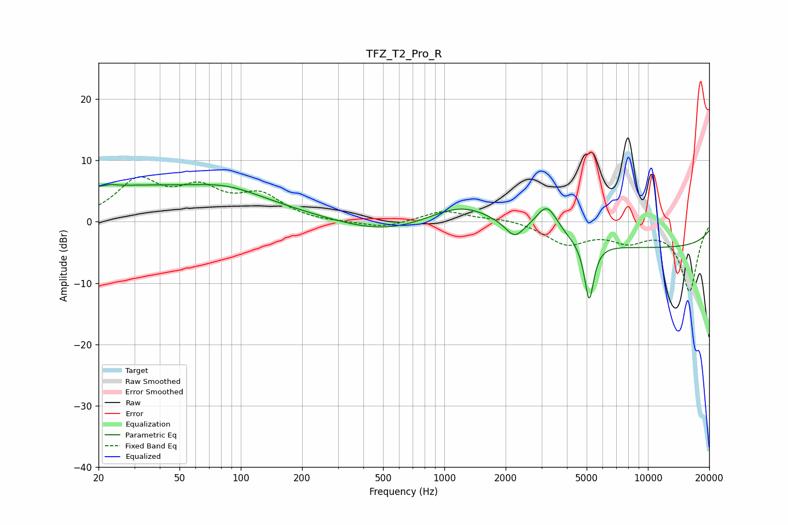

# TFZ_T2_Pro_R
See [usage instructions](https://github.com/jaakkopasanen/AutoEq#usage) for more options and info.

### Parametric EQs
Apply preamp of -6.2 dB when using parametric equalizer.

|   # | Type    |   Fc (Hz) |    Q |   Gain (dB) |
|-----|---------|-----------|------|-------------|
|   1 | Peaking |        23 | 6    |         2.1 |
|   2 | Peaking |        23 | 5.91 |        -1.9 |
|   3 | Peaking |        28 | 0.18 |         5.8 |
|   4 | Peaking |        87 | 0.96 |         1.3 |
|   5 | Peaking |       511 | 0.64 |        -2.1 |
|   6 | Peaking |      1239 | 0.86 |         3.8 |
|   7 | Peaking |      2212 | 3.28 |        -2.4 |
|   8 | Peaking |      3191 | 2.56 |         5   |
|   9 | Peaking |      5145 | 6    |        -9.6 |
|  10 | Peaking |     10000 | 0.18 |        -4.2 |

### Fixed Band EQs
When using fixed band (also called graphic) equalizer, apply preamp of **-7.4 dB** (if available) and set gains manually with these parameters.

|   # | Type    |   Fc (Hz) |    Q |   Gain (dB) |
|-----|---------|-----------|------|-------------|
|   1 | Peaking |        31 | 1.41 |         6.3 |
|   2 | Peaking |        62 | 1.41 |         4.6 |
|   3 | Peaking |       125 | 1.41 |         3.9 |
|   4 | Peaking |       250 | 1.41 |        -0.2 |
|   5 | Peaking |       500 | 1.41 |        -1.1 |
|   6 | Peaking |      1000 | 1.41 |         1.8 |
|   7 | Peaking |      2000 | 1.41 |         0.6 |
|   8 | Peaking |      4000 | 1.41 |        -3.5 |
|   9 | Peaking |      8000 | 1.41 |        -2.6 |
|  10 | Peaking |     16000 | 1.41 |       -11.2 |

### Graphs

