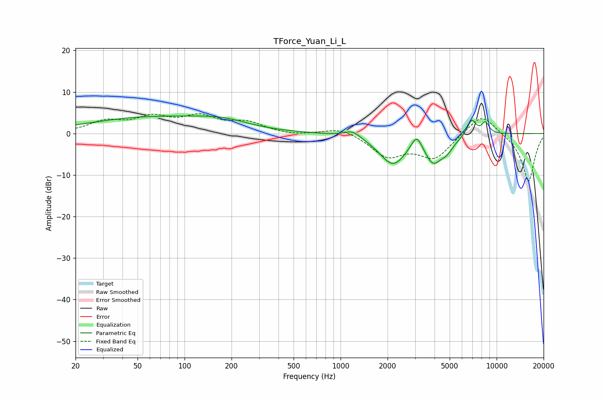

# TForce_Yuan_Li_L
See [usage instructions](https://github.com/jaakkopasanen/AutoEq#usage) for more options and info.

### Parametric EQs
Apply preamp of -4.3 dB when using parametric equalizer.

|   # | Type    |   Fc (Hz) |    Q |   Gain (dB) |
|-----|---------|-----------|------|-------------|
|   1 | Peaking |        60 | 0.35 |         3.8 |
|   2 | Peaking |       115 | 1.66 |         0.1 |
|   3 | Peaking |       178 | 0.86 |         1.7 |
|   4 | Peaking |      1194 | 2.71 |         1.7 |
|   5 | Peaking |      2163 | 1.59 |        -7.3 |
|   6 | Peaking |      3071 | 3.96 |         4   |
|   7 | Peaking |      3912 | 2.57 |        -5.8 |
|   8 | Peaking |      4806 | 3.09 |        -2.5 |
|   9 | Peaking |      6915 | 4.71 |         3.9 |
|  10 | Peaking |      8475 | 5.42 |         2.7 |

### Fixed Band EQs
When using fixed band (also called graphic) equalizer, apply preamp of **-4.9 dB** (if available) and set gains manually with these parameters.

|   # | Type    |   Fc (Hz) |    Q |   Gain (dB) |
|-----|---------|-----------|------|-------------|
|   1 | Peaking |        31 | 1.41 |         2.6 |
|   2 | Peaking |        62 | 1.41 |         3.4 |
|   3 | Peaking |       125 | 1.41 |         3.6 |
|   4 | Peaking |       250 | 1.41 |         2.4 |
|   5 | Peaking |       500 | 1.41 |        -0.5 |
|   6 | Peaking |      1000 | 1.41 |         1.6 |
|   7 | Peaking |      2000 | 1.41 |        -5.2 |
|   8 | Peaking |      4000 | 1.41 |        -5.7 |
|   9 | Peaking |      8000 | 1.41 |         5.3 |
|  10 | Peaking |     16000 | 1.41 |       -11.7 |

### Graphs

