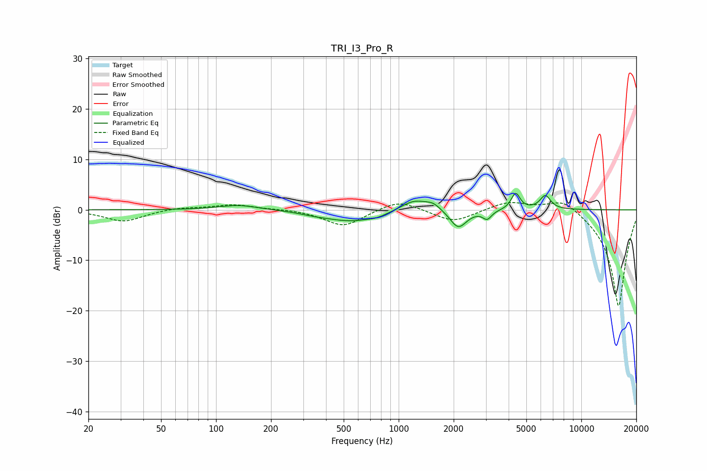

# TRI_I3_Pro_R
See [usage instructions](https://github.com/jaakkopasanen/AutoEq#usage) for more options and info.

### Parametric EQs
Apply preamp of -3.4 dB when using parametric equalizer.

|   # | Type    |   Fc (Hz) |    Q |   Gain (dB) |
|-----|---------|-----------|------|-------------|
|   1 | Peaking |       134 | 1.31 |         1   |
|   2 | Peaking |       348 | 1.92 |        -0.3 |
|   3 | Peaking |       545 | 0.97 |        -2.2 |
|   4 | Peaking |       760 | 2.72 |        -0.5 |
|   5 | Peaking |      1215 | 1.92 |         2.2 |
|   6 | Peaking |      1544 | 3.39 |         1.2 |
|   7 | Peaking |      2121 | 3.13 |        -3.7 |
|   8 | Peaking |      3052 | 6    |        -1.6 |
|   9 | Peaking |      4370 | 5.9  |         3.3 |
|  10 | Peaking |      6350 | 4.71 |         2.8 |

### Fixed Band EQs
When using fixed band (also called graphic) equalizer, apply preamp of **-1.5 dB** (if available) and set gains manually with these parameters.

|   # | Type    |   Fc (Hz) |    Q |   Gain (dB) |
|-----|---------|-----------|------|-------------|
|   1 | Peaking |        31 | 1.41 |        -2.3 |
|   2 | Peaking |        62 | 1.41 |         0.5 |
|   3 | Peaking |       125 | 1.41 |         1   |
|   4 | Peaking |       250 | 1.41 |         0.2 |
|   5 | Peaking |       500 | 1.41 |        -3.3 |
|   6 | Peaking |      1000 | 1.41 |         2.1 |
|   7 | Peaking |      2000 | 1.41 |        -2.5 |
|   8 | Peaking |      4000 | 1.41 |         1.8 |
|   9 | Peaking |      8000 | 1.41 |         2.7 |
|  10 | Peaking |     16000 | 1.41 |       -19.3 |

### Graphs

