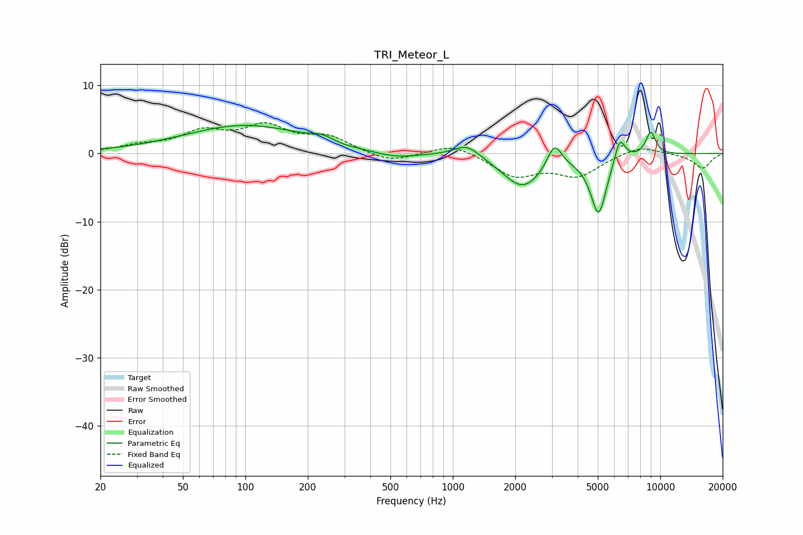

# TRI_Meteor_L
See [usage instructions](https://github.com/jaakkopasanen/AutoEq#usage) for more options and info.

### Parametric EQs
Apply preamp of -4.2 dB when using parametric equalizer.

|   # | Type    |   Fc (Hz) |    Q |   Gain (dB) |
|-----|---------|-----------|------|-------------|
|   1 | Peaking |       100 | 0.48 |         4.1 |
|   2 | Peaking |       235 | 2.59 |         0.8 |
|   3 | Peaking |       297 | 2.34 |        -0.2 |
|   4 | Peaking |       522 | 1.27 |        -0.9 |
|   5 | Peaking |      1170 | 2.19 |         1.9 |
|   6 | Peaking |      2176 | 1.44 |        -5   |
|   7 | Peaking |      3090 | 4.09 |         3.7 |
|   8 | Peaking |      5045 | 3.56 |        -8.8 |
|   9 | Peaking |      6384 | 5.26 |         3.6 |
|  10 | Peaking |      8994 | 5.22 |         3.4 |

### Fixed Band EQs
When using fixed band (also called graphic) equalizer, apply preamp of **-4.6 dB** (if available) and set gains manually with these parameters.

|   # | Type    |   Fc (Hz) |    Q |   Gain (dB) |
|-----|---------|-----------|------|-------------|
|   1 | Peaking |        31 | 1.41 |         0.9 |
|   2 | Peaking |        62 | 1.41 |         2.8 |
|   3 | Peaking |       125 | 1.41 |         3.6 |
|   4 | Peaking |       250 | 1.41 |         2.2 |
|   5 | Peaking |       500 | 1.41 |        -1.4 |
|   6 | Peaking |      1000 | 1.41 |         1.5 |
|   7 | Peaking |      2000 | 1.41 |        -3.2 |
|   8 | Peaking |      4000 | 1.41 |        -3.1 |
|   9 | Peaking |      8000 | 1.41 |         1.3 |
|  10 | Peaking |     16000 | 1.41 |        -2.2 |

### Graphs

