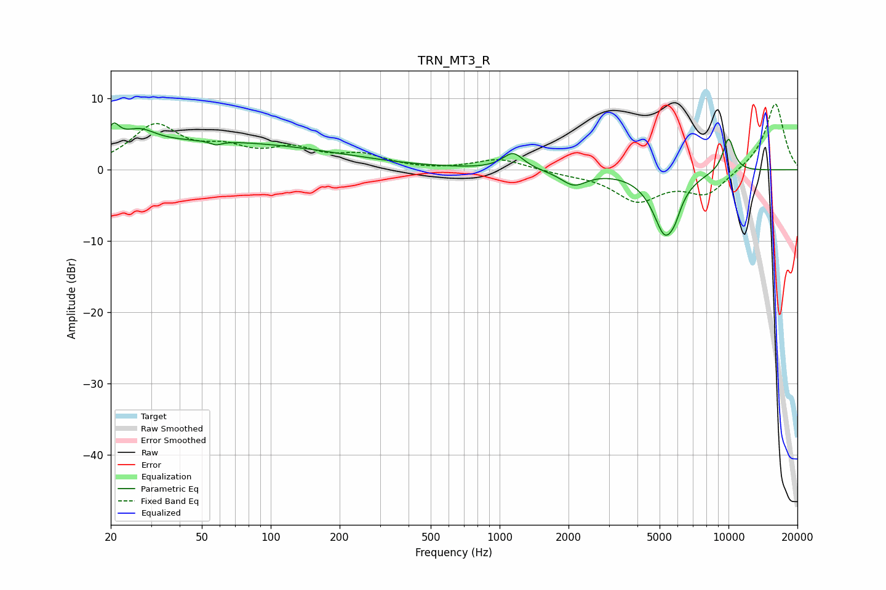

# TRN_MT3_R
See [usage instructions](https://github.com/jaakkopasanen/AutoEq#usage) for more options and info.

### Parametric EQs
Apply preamp of -6.7 dB when using parametric equalizer.

|   # | Type    |   Fc (Hz) |    Q |   Gain (dB) |
|-----|---------|-----------|------|-------------|
|   1 | Peaking |        21 | 5.59 |         2.4 |
|   2 | Peaking |        27 | 2.1  |         1.9 |
|   3 | Peaking |        49 | 0.22 |         3.9 |
|   4 | Peaking |        58 | 5.96 |        -0.5 |
|   5 | Peaking |      1145 | 3.09 |         2.4 |
|   6 | Peaking |      2109 | 2.51 |        -2   |
|   7 | Peaking |      5282 | 2.53 |        -8.7 |
|   8 | Peaking |      5838 | 5.52 |        -1.3 |
|   9 | Peaking |     10000 | 4.22 |         2.4 |
|  10 | Peaking |     10000 | 5.38 |         2.4 |

### Fixed Band EQs
When using fixed band (also called graphic) equalizer, apply preamp of **-9.3 dB** (if available) and set gains manually with these parameters.

|   # | Type    |   Fc (Hz) |    Q |   Gain (dB) |
|-----|---------|-----------|------|-------------|
|   1 | Peaking |        31 | 1.41 |         5.9 |
|   2 | Peaking |        62 | 1.41 |         2.3 |
|   3 | Peaking |       125 | 1.41 |         2.5 |
|   4 | Peaking |       250 | 1.41 |         1.8 |
|   5 | Peaking |       500 | 1.41 |        -0.1 |
|   6 | Peaking |      1000 | 1.41 |         1.6 |
|   7 | Peaking |      2000 | 1.41 |        -0.4 |
|   8 | Peaking |      4000 | 1.41 |        -4.2 |
|   9 | Peaking |      8000 | 1.41 |        -3.4 |
|  10 | Peaking |     16000 | 1.41 |         9.5 |

### Graphs

