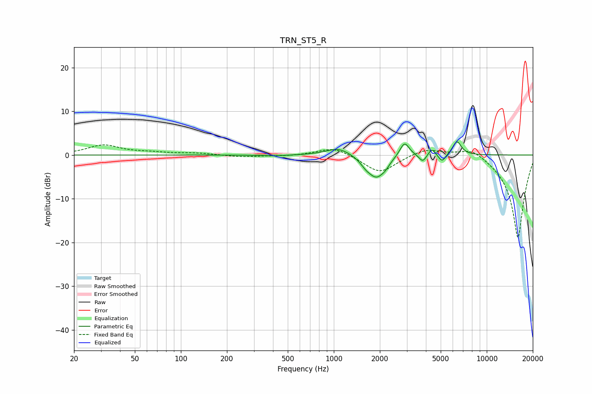

# TRN_ST5_R
See [usage instructions](https://github.com/jaakkopasanen/AutoEq#usage) for more options and info.

### Parametric EQs
Apply preamp of -3.1 dB when using parametric equalizer.

|   # | Type    |   Fc (Hz) |    Q |   Gain (dB) |
|-----|---------|-----------|------|-------------|
|   1 | Peaking |       404 | 1.54 |        -0.2 |
|   2 | Peaking |      1074 | 1.77 |         1.8 |
|   3 | Peaking |      1619 | 3.89 |        -1.2 |
|   4 | Peaking |      1906 | 2.53 |        -4.9 |
|   5 | Peaking |      2181 | 6    |        -0.7 |
|   6 | Peaking |      2898 | 4.52 |         3.4 |
|   7 | Peaking |      3816 | 6    |        -1.8 |
|   8 | Peaking |      4371 | 6    |         1.7 |
|   9 | Peaking |      5104 | 6    |        -1.8 |
|  10 | Peaking |      6386 | 4.81 |         3.2 |

### Fixed Band EQs
When using fixed band (also called graphic) equalizer, apply preamp of **-2.4 dB** (if available) and set gains manually with these parameters.

|   # | Type    |   Fc (Hz) |    Q |   Gain (dB) |
|-----|---------|-----------|------|-------------|
|   1 | Peaking |        31 | 1.41 |         2.2 |
|   2 | Peaking |        62 | 1.41 |         0.4 |
|   3 | Peaking |       125 | 1.41 |         0.4 |
|   4 | Peaking |       250 | 1.41 |        -0.5 |
|   5 | Peaking |       500 | 1.41 |        -0.2 |
|   6 | Peaking |      1000 | 1.41 |         1.9 |
|   7 | Peaking |      2000 | 1.41 |        -4.2 |
|   8 | Peaking |      4000 | 1.41 |         1.7 |
|   9 | Peaking |      8000 | 1.41 |         2.1 |
|  10 | Peaking |     16000 | 1.41 |       -19.2 |

### Graphs

