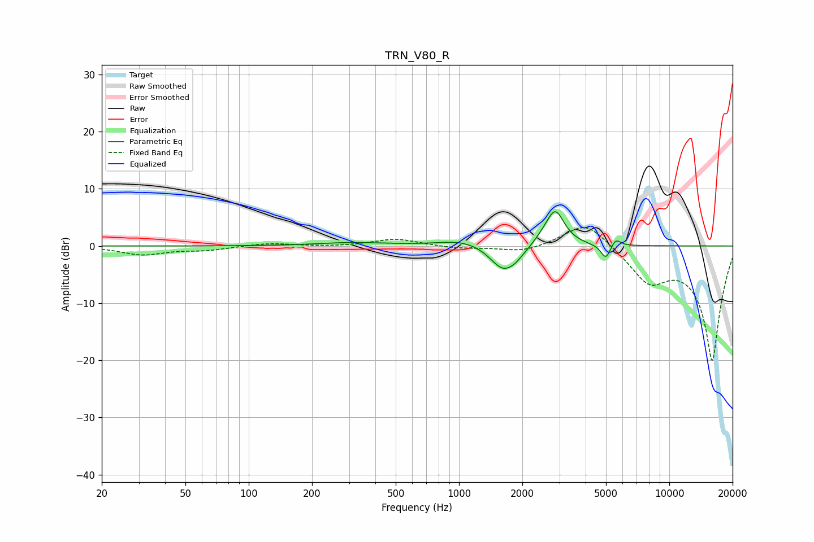

# TRN_V80_R
See [usage instructions](https://github.com/jaakkopasanen/AutoEq#usage) for more options and info.

### Parametric EQs
Apply preamp of -6.1 dB when using parametric equalizer.

|   # | Type    |   Fc (Hz) |    Q |   Gain (dB) |
|-----|---------|-----------|------|-------------|
|   1 | Peaking |       291 | 0.97 |         0.5 |
|   2 | Peaking |       431 | 0.95 |         0.1 |
|   3 | Peaking |      1043 | 1.3  |         1.1 |
|   4 | Peaking |      1619 | 2.31 |        -4.3 |
|   5 | Peaking |      1852 | 4.37 |        -0.6 |
|   6 | Peaking |      2095 | 1.84 |        -0.9 |
|   7 | Peaking |      2457 | 2.36 |         1.2 |
|   8 | Peaking |      2868 | 3.21 |         6   |
|   9 | Peaking |      5000 | 5.92 |        -2.7 |
|  10 | Peaking |      5541 | 6    |         1.5 |

### Fixed Band EQs
When using fixed band (also called graphic) equalizer, apply preamp of **-3.3 dB** (if available) and set gains manually with these parameters.

|   # | Type    |   Fc (Hz) |    Q |   Gain (dB) |
|-----|---------|-----------|------|-------------|
|   1 | Peaking |        31 | 1.41 |        -1.5 |
|   2 | Peaking |        62 | 1.41 |        -0.7 |
|   3 | Peaking |       125 | 1.41 |         0.5 |
|   4 | Peaking |       250 | 1.41 |        -0.1 |
|   5 | Peaking |       500 | 1.41 |         1.3 |
|   6 | Peaking |      1000 | 1.41 |        -0.4 |
|   7 | Peaking |      2000 | 1.41 |        -1.1 |
|   8 | Peaking |      4000 | 1.41 |         4.6 |
|   9 | Peaking |      8000 | 1.41 |        -5.6 |
|  10 | Peaking |     16000 | 1.41 |       -20   |

### Graphs

