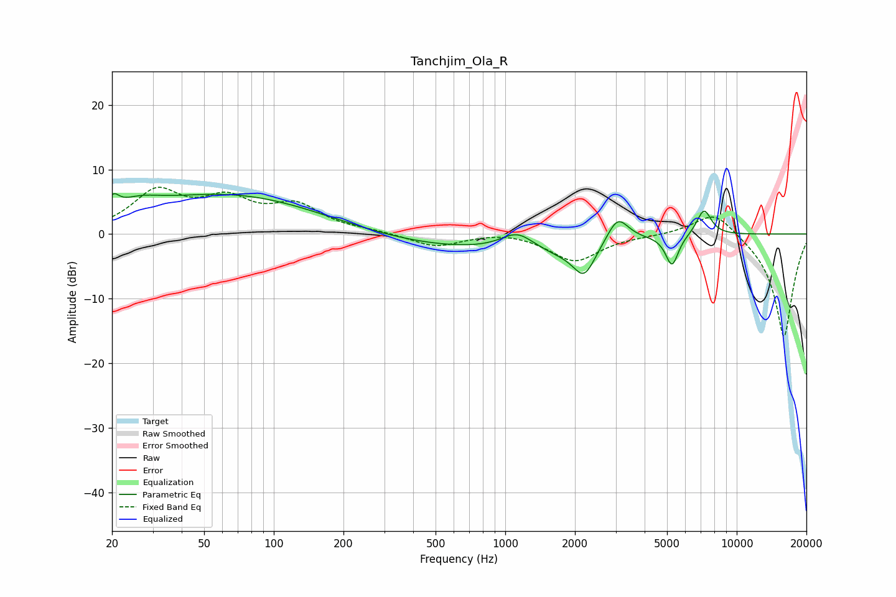

# Tanchjim_Ola_R
See [usage instructions](https://github.com/jaakkopasanen/AutoEq#usage) for more options and info.

### Parametric EQs
Apply preamp of -6.3 dB when using parametric equalizer.

|   # | Type    |   Fc (Hz) |    Q |   Gain (dB) |
|-----|---------|-----------|------|-------------|
|   1 | Peaking |        20 | 5.85 |         2   |
|   2 | Peaking |        26 | 1.56 |         1.6 |
|   3 | Peaking |        73 | 0.31 |         6.7 |
|   4 | Peaking |       483 | 0.23 |        -2.8 |
|   5 | Peaking |      1127 | 1.99 |         2.6 |
|   6 | Peaking |      1691 | 1.4  |        -1.2 |
|   7 | Peaking |      2193 | 2.88 |        -5   |
|   8 | Peaking |      3060 | 3.05 |         4   |
|   9 | Peaking |      5253 | 5.03 |        -4.8 |
|  10 | Peaking |      7219 | 4.23 |         4   |

### Fixed Band EQs
When using fixed band (also called graphic) equalizer, apply preamp of **-7.3 dB** (if available) and set gains manually with these parameters.

|   # | Type    |   Fc (Hz) |    Q |   Gain (dB) |
|-----|---------|-----------|------|-------------|
|   1 | Peaking |        31 | 1.41 |         6.2 |
|   2 | Peaking |        62 | 1.41 |         4.6 |
|   3 | Peaking |       125 | 1.41 |         4   |
|   4 | Peaking |       250 | 1.41 |         0.4 |
|   5 | Peaking |       500 | 1.41 |        -2   |
|   6 | Peaking |      1000 | 1.41 |         0.5 |
|   7 | Peaking |      2000 | 1.41 |        -4.2 |
|   8 | Peaking |      4000 | 1.41 |        -0.1 |
|   9 | Peaking |      8000 | 1.41 |         3.9 |
|  10 | Peaking |     16000 | 1.41 |       -16.1 |

### Graphs

